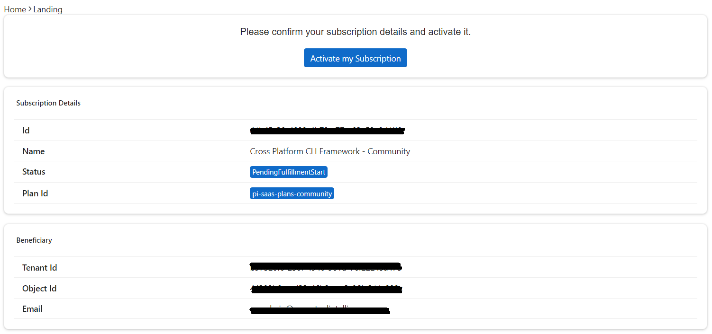

## Buy on [Microsoft AppSource](https://docs.microsoft.com/en-us/marketplace/purchase-software-appsource)

### Requirements
- A Microsoft work or school account. If you don't have an account, follow the link to "Sign up for a free account" during the purchase process.
- A valid credit card in the country/region where you are purchasing the offer. Credit cards supported: Visa, Master Card, American Express, and Discover.

### Search the offer
You can directly use the [app source link](https://appsource.microsoft.com/en-us/product/web-apps/perpetualintelligence1587956089731.pi-saas-cli-microsoft) or search offer name, for example "Cross-Platform CLI Framework" from `Perpetual Intelligence L.L.C.`

### Purchase the offer
You can start free with our `Community` edition for educational, test, and evaluation purposes. For non-educational and production environments, you require a paid commercial license.
1. Select `Get it now`
2. Choose the plan
3. Set the billing term
4. Enter your billing address
5. Enter your payment method (credit card information)
6. Review your order 

7. Select `Place order`

For more information go to [Purchase software from AppSource | Microsoft Docs](https://docs.microsoft.com/en-us/marketplace/purchase-software-appsource).

### Configure the purchase
After your order is received, it can take several minutes to get confirmed. You will receive a link to configure your SaaS subscription on the page, as well as an email confirming the purchase and the link to complete the configuration.

1. On the Order Confirmation page, select `Configure` or `Configure SaaS account`. Alternatively, you can use the Configuration link sent to you in the confirmation email.
2. Complete provisioning and set up on our [SaaS consumer fulfillment portal](https://consumer.perpetualintelligence.com/).

> **Note**: This step is mandatory, and you must initiate it from your order confirmation page or the link sent you in the confirmation email.

### Activate your subscription
Upon initiating the configure or activation, you will be redirected to our [SaaS consumer fulfillment portal](https://consumer.perpetualintelligence.com/) to activate your subscription.

1. Login with your Microsoft account
2. Review your subscription details
3. Select `Activate my Subscription`

### Generate License Keys
Upon subscription activation you can generate the license keys.

1. Open the subscription page
2. Scroll down to `License Keys`
3. Select `Generate`

4. Download license file

5. Configure your application to use the [license keys](../../articles/picli/licensing/usage.md)
