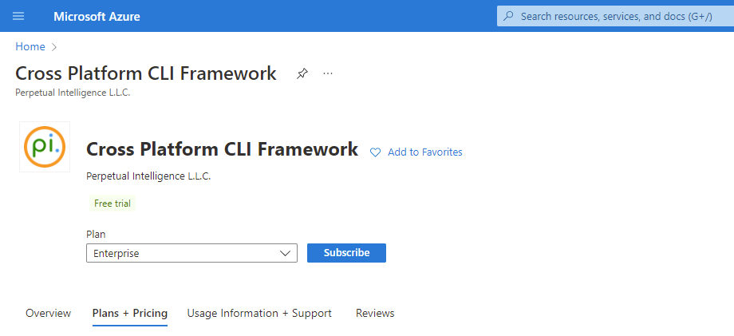
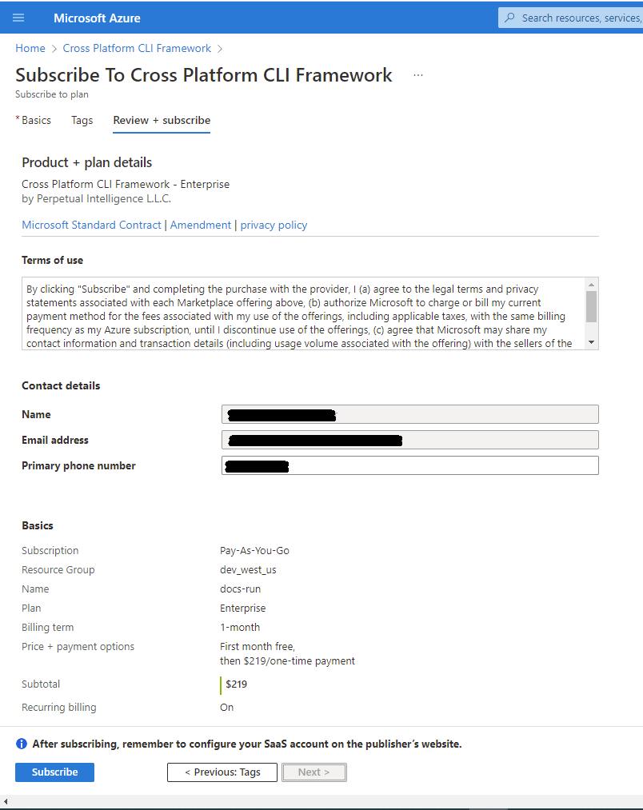
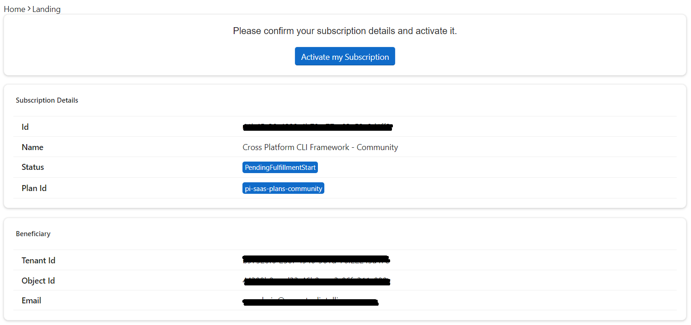
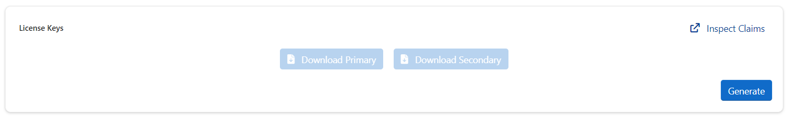
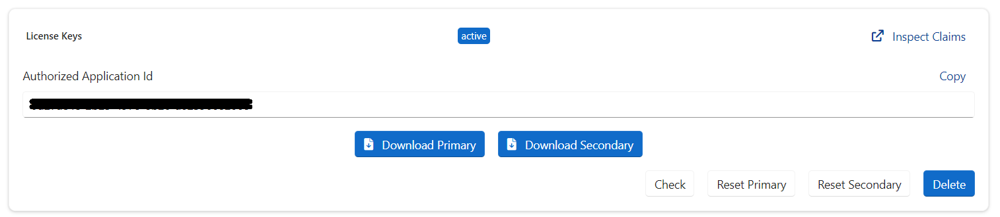

## Buy on [Microsoft Azure](https://docs.microsoft.com/en-us/marketplace/purchase-saas-offer-in-azure-portal)

### Requirements
- An Azure user account with access to an appropriate Azure subscription. This subscription will be used for billing of your purchased SaaS offer.
- Permission to purchase from Azure Marketplace.

### Search the offer
You can directly use the [SaaS Azure link](https://portal.azure.com/#create/perpetualintelligence1587956089731.pi-saas-cli-microsoft/preview) or in the Azure portal, in Marketplace, search the SaaS offer you want, for example "Cross-Platform CLI Framework" from `Perpetual Intelligence L.L.C.`

### Purchase the offer
You can start free with our `Community` edition for educational, test, and evaluation purposes. For non-educational and production environments, you require a paid commercial license.

1. Choose the plan
2. Select `Subscribe`
3. You're redirected to the `Basics` tab, where you:
    1. Define which subscription you want to use for billing.
    2. Choose or create a resource group to hold the SaaS application.
    3. Type a name for the SaaS subscription, to easily identify it later. You can't change this name after you have purchased the SaaS subscription.
    4. Under Plan, you'll see the plan you selected in the product details page (PDP)
4. Proceed to the `Tags` tab. Tags are key/value pairs that you can define.
5. Continue to `Review + Subscribe` to go through the offer and plan details.

6. Upon confirmation, select `Subscribe`.

For more information go to [Purchase a SaaS offer in the Azure portal | Microsoft Docs](https://docs.microsoft.com/en-us/marketplace/purchase-saas-offer-in-azure-portal).

### Configure the purchase
When you select Subscribe, you see the following message: ***Your SaaS subscription is in progress***. This process takes a few minutes. Don't close the window until it's finished.

1. After the subscription is completed, you'll receive an email requesting you to activate the new subscription.
2. To complete the process and start using the SaaS offer, you're required to configure your subscription. In the SaaS offer in the online store, select `Configure account now` or in the email, select `Configure now`. You're redirected to the our [SaaS consumer fulfillment portal](https://consumer.perpetualintelligence.com/). Billing starts after your account is configured on our consumer fullfillment portal.

> **Note**: This step is mandatory, and you must initiate it from your Azure Portal or the link sent you in the confirmation email. If you don’t complete the configuration process within 30 days, the SaaS subscription is automatically deleted.

### Activate your subscription
Upon initiating the configure or activation, you will be redirected to our [SaaS consumer fulfillment portal](https://consumer.perpetualintelligence.com/) to activate your subscription.

1. Login with your Microsoft account
2. Review your subscription details
3. Select `Activate my Subscription`

### Generate License Keys
Upon subscription activation you can generate the license keys.

1. Open the subscription page
2. Scroll down to `License Keys`
3. Select `Generate`

4. Download license file

5. Configure your application to use the [license keys](../../articles/pi-cli/licensing/usage.md)
