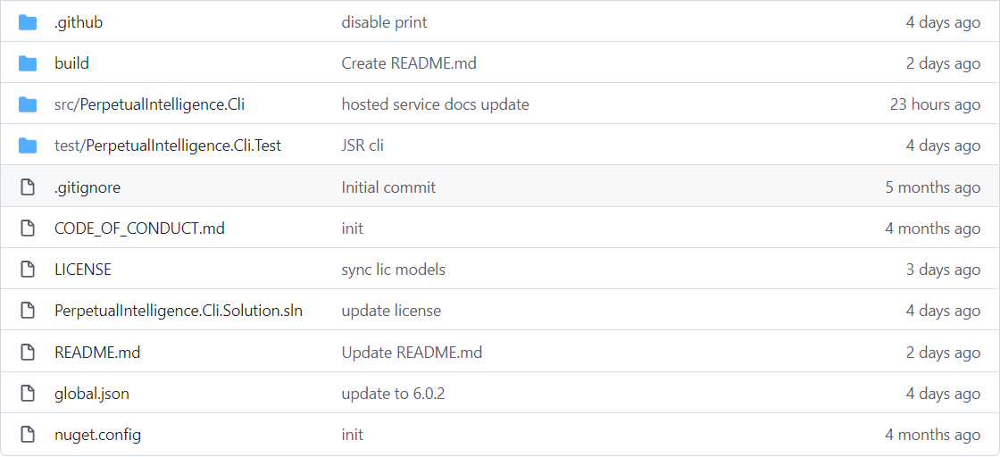

# Introducing pi-cli
`pi-cli` is the most flexible cross-platform framework for building modern CLI terminals. The framework makes it easy to build CLIs for your company, product, service, SaaS, or development and testing needs. Enterprises can create CLIs with few flags or advanced complex CLIs with organization commands, grouped commands, subcommands, arguments, and options.

> ***Take your app or service to the command line with Unicode support and build CLI terminals in a user language of your choice.***

## Craftsmanship
We crafted the `pi-cli` framework to be cross-platform, hosting and deployment agnostic, and fully customizable. We strongly believe .NET provides a rich set of [DSL](https://docs.microsoft.com/en-us/visualstudio/modeling/about-domain-specific-languages?view=vs-2022) and [DDD](https://docs.microsoft.com/en-us/dotnet/architecture/microservices/microservice-ddd-cqrs-patterns/ddd-oriented-microservice) tools and languages, and `pi-cli` directly supports the .NET (traditional), .NET core, ASP.NET Core, and NET6+ framework. Thus it is naturally the defacto standard in developing cross-platform CLI systems for your apps, services, and developer tools in the entire .NET ecosystem. It lets enterprises build ground-up CLI terminals or migrate their existing CLI apps and terminals with the modern, scalable and distributed architecture.

> ***In short, if what you want is doable in the .NET ecosystem, it is possible with the `pi-cli` framework.***

## Open Source
Our entire source code is on [GitHub](https://github.com/perpetualintelligence/cli). It enables community collaboration, troubleshoot issues, and helps get us your feedback on the features and documentation. It also promotes a better understanding of architecture and design.

> ***See our [licensing terms](https://terms.perpetualintelligence.com/articles/licensing.html), [licenses](licensing/intro.md) and [pricing](https://www.perpetualintelligence.com/products/picli#pricing).***

## OS
Our CICD pipeline builds the framework with Github [hosted runners](https://docs.github.com/en/actions/using-github-hosted-runners/about-github-hosted-runners) for the following OS platform. However, it supports all the additional platforms that .NET supports.

## Packaging
The licensed libraries can be accessed via Nuget:

## Build
The [GitHub](https://github.com/perpetualintelligence/cli) repo contains all the build and release artifacts to build, test and publish the `pi-cli` source.

 

## Terminal UX
The `pi-cli` framework does not enforce any specific terminal or console UX experience because this is always custom to the project. However, we provide you with a starting point for your terminal lifetime and UX customization.
- [CliHostedService](xref:PerpetualIntelligence.Cli.Integration.CliHostedService)

## Classes
[Classes and Object browser](../../api/index.md)

## Learn to Use
With the `pi-cli` framework, you don't have to be a microservices or distributed systems expert to build a modern and scalable CLI terminal. You build and learn as you go on, and eventually, you become an expert :) similar to an [eventually-consistent system](https://docs.microsoft.com/en-us/dotnet/architecture/microservices/architect-microservice-container-applications/distributed-data-management). You can quickly build CLIs for simple use cases, a CLI terminal that handles authentication, or a CLI terminal that interacts with a complex distributed system via protected APIs. We believe in an agile development and agile learning. So, pick a learning model that works for you!

### I want to create my first modern CLI and learn as I go on
- Please create an account with us at https://www.perpetualintelligence.com
- Pick a pricing plan that works for you. Our community edition is free for educational, research, and non-commercial use. You must have a commercial license to use the `pi-cli` framework in a non-educational, or production environment
- Browse our code samples [here](../samples.md)
- Set your License Key (a valid license key is required for both community and commercial licenses)
- Build, debug make changes and learn the concepts and you go on
- We cant wait to see the fantastic CLI terminals you build !

### I want to understand the concepts first
Continue reading, and we will explain all the concepts. We recommend you get familiar with the common architectural principles first as they enable our framework to be extendible, customizable, and remain scalable.

- [Dependency Injection](https://docs.microsoft.com/en-us/dotnet/core/extensions/dependency-injection)
- [Dependency Inversion](https://docs.microsoft.com/en-us/dotnet/architecture/modern-web-apps-azure/architectural-principles#dependency-inversion)
- [Options Patterns](https://docs.microsoft.com/en-us/dotnet/core/extensions/options)
- [Separation of concerns](https://docs.microsoft.com/en-us/dotnet/architecture/modern-web-apps-azure/architectural-principles#separation-of-concerns)
- [Single Responsibility](https://docs.microsoft.com/en-us/dotnet/architecture/modern-web-apps-azure/architectural-principles#separation-of-concerns)
- [Bounded Context](https://docs.microsoft.com/en-us/dotnet/architecture/modern-web-apps-azure/architectural-principles#bounded-contexts)

## Demo License
Use our [demo license](../pi-demo/intro.md) feature for quick onboarding, evaluation, and testing our sample code base on [GitHub](https://github.com/perpetualintelligence/docs/tree/main/samples/tutorials).

## Samples
Learn to use the `pi-cli` framework by exploring our working samples on [Github](https://github.com/perpetualintelligence/docs/tree/main/samples/tutorials/pi-cli). Just clone the Visual Studio solution, update the configuration options with your license key, and start exploring!

## Issues and feature requests
Please report [issue or feature request](https://github.com/perpetualintelligence/cli/issues) directly on our official github repo.

## References
- [Microservices](https://github.com/dotnet/docs/tree/main/docs/architecture/microservices)
- [.NET application architecture](https://docs.microsoft.com/en-us/dotnet/architecture/)

