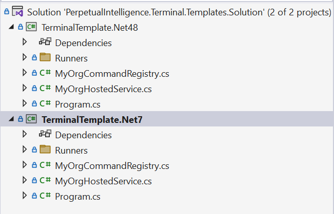
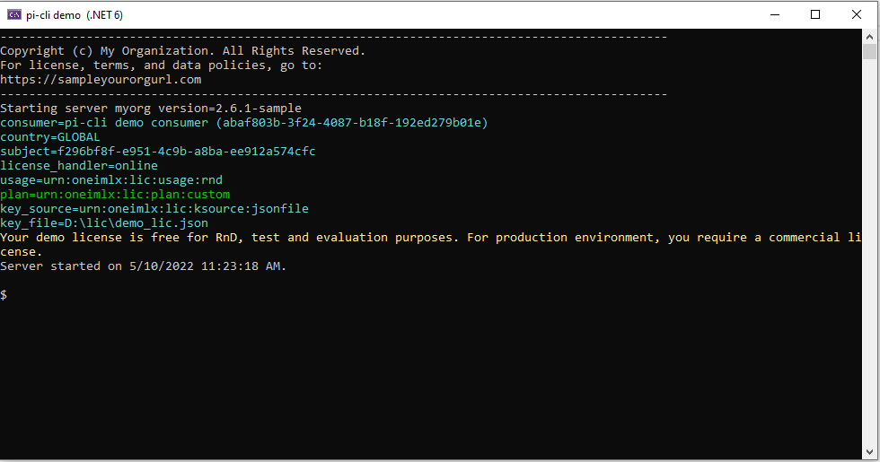
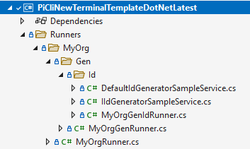
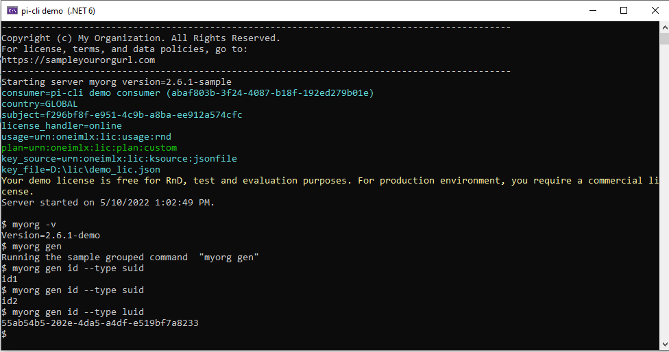
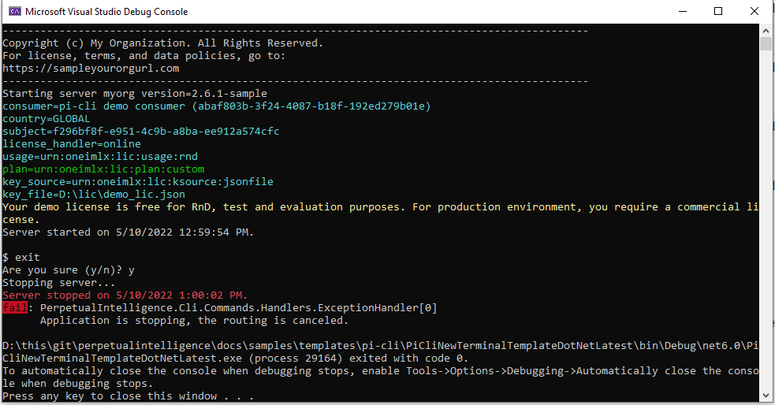

# Templates

Our ready-to-use sample templates allow quick onboarding for application authors to create enterprise-grade modern terminals.

## How do I use the templates?
Clone or download the template on your dev environment.

We provide 2 read-to-use templates:
- [.NET 4.8](https://github.com/perpetualintelligence/docs/tree/main/samples/templates/terminal/TerminalTemplate.Net48)
- [.NET 7](https://github.com/perpetualintelligence/docs/tree/main/samples/templates/terminal/TerminalTemplate.Net7)



The templates have `terminal` framework configured with our [demo license](https://www.perpetualintelligence.com/products/pidemo/licensing). Build the solution `PerpetualIntelligence.Terminal.Templates.Solution.sln`, and you are ready to go!

## Details
You can use the templates to build new terminals or migrate your legacy console apps and modernize them. 

This section explains the code changes in the templates. To enable `terminal` you need to:
1. Install NuGet Package
2. Add terminal hosted service
3. Configure your terminal options
4. Add a routing service
5. Add handler, 
6. Start command router
7. Stop the router

### Install NuGet Package
The `terminal` framework is accessible by installing the following Nuget package.

[](https://www.nuget.org/packages/PerpetualIntelligence.Terminal)

### Add terminal hosted service
The @PerpetualIntelligence.Terminal.Integration.TerminalHostedService is a hosted service that manages application lifetime, performs licensing and configuration checks, and enables terminal UX customization.

This example shows the default view when you run the template. You can customize it by overriding the methods shown in the template code below.



```
using Microsoft.Extensions.Hosting;
using Microsoft.Extensions.Logging;
using PerpetualIntelligence.Terminal.Configuration.Options;
using PerpetualIntelligence.Terminal.Integration;
using PerpetualIntelligence.Terminal.Licensing;
using PerpetualIntelligence.Terminal.Services;

namespace terminalNewTerminalTemplateDotNetLatest
{
    /// <summary>
    /// The sample <c>myorg</c> hosted service. This class enables UX customization for your cli terminal.
    /// </summary>
    public class MyOrgHostedService : CliHostedService
    {
        /// <summary>
        /// Initialize a new instance.
        /// </summary>
        /// <param name="serviceProvider">The service provider.</param>
        /// <param name="cliOptions">The configuration options.</param>
        /// <param name="logger">The logger.</param>
        public MyOrgHostedService(IServiceProvider serviceProvider, CliOptions cliOptions, ILogger<CliHostedService> logger) : base(serviceProvider, cliOptions, logger)
        {
        }

        /// <summary>
        /// Perform custom configuration option checks at startup.
        /// </summary>
        /// <param name="options"></param>
        /// <returns></returns>
        protected override Task CheckHostApplicationConfigurationAsync(CliOptions options)
        {
            return Task.CompletedTask;
        }

        /// <summary>
        /// The <see cref="IHostApplicationLifetime.ApplicationStarted"/> handler.
        /// </summary>
        protected override void OnStarted()
        {
            Console.WriteLine("Server started on {0}.", DateTime.UtcNow.ToLocalTime().ToString());
            Console.WriteLine();
        }

        /// <summary>
        /// The <see cref="IHostApplicationLifetime.ApplicationStopped"/> handler.
        /// </summary>
        protected override void OnStopped()
        {
            ConsoleHelper.WriteLineColor(ConsoleColor.Red, "Server stopped on {0}.", DateTime.UtcNow.ToLocalTime().ToString());
        }

        /// <summary>
        /// The <see cref="IHostApplicationLifetime.ApplicationStopping"/> handler.
        /// </summary>
        protected override void OnStopping()
        {
            Console.WriteLine("Stopping server...");
        }

        /// <summary>
        /// Print <c>cli</c> terminal header.
        /// </summary>
        /// <returns></returns>
        protected override Task PrintHostApplicationHeaderAsync()
        {
            Console.WriteLine("---------------------------------------------------------------------------------------------");
            Console.WriteLine("Copyright (c) My Organization. All Rights Reserved.");
            Console.WriteLine("For license, terms, and data policies, go to:");
            Console.WriteLine("https://sampleyourorgurl.com");
            Console.WriteLine("---------------------------------------------------------------------------------------------");

            Console.WriteLine($"Starting server myorg version=2.6.1-sample");
            return Task.CompletedTask;
        }

        /// <summary>
        /// Print host application licensing information.
        /// </summary>
        /// <param name="license">The extracted license.</param>
        /// <returns></returns>
        protected override async Task PrintHostApplicationLicensingAsync(License license)
        {
            // Print custom licensing info or remove it completely.
            await base.PrintHostApplicationLicensingAsync(license);
        }
    }
}

```

### Add `terminal` and configure the options
You enable `terminal` framework by adding the DI services in your `Program.cs` file. This example code shows the default configuration when you run the template.

```
/// <summary>
/// Configures the required <c>terminal</c> services.
/// </summary>
void ConfigureServices(IServiceCollection services)
{
    Console.Title = "terminal demo  (.NET 6)";

    services.AddCli(options =>
    {
        // Error info
        options.Logging.ObsureErrorArguments = false;

        // Commands, arguments and options
        options.Extractor.ArgumentAlias = true;
        options.Extractor.ArgumentPrefix = "--";
        options.Extractor.ArgumentAliasPrefix = "-";
        options.Extractor.DefaultArgumentValue = true;
        options.Extractor.DefaultArgument = true;
        options.Extractor.ArgumentValueWithIn = "\"";
        options.Extractor.ArgumentValueSeparator = " ";
        options.Extractor.Separator = " ";

        // Checkers
        options.Checker.StrictArgumentValueType = true;

        // Http
        options.Http.HttpClientName = "pi-demo";

        // Licensing
        options.Licensing.AuthorizedApplicationId = DemoIdentifiers.terminalDemoAuthorizedApplicationId;
        options.Licensing.LicenseKey = "D:\\lic\\demo_lic.json"; // Download the license file in this location or specify your location
        options.Licensing.ConsumerTenantId = DemoIdentifiers.terminalDemoConsumerTenantId;
        options.Licensing.Subject = DemoIdentifiers.terminalDemoSubject;
        options.Licensing.ProviderId = LicenseProviders.PerpetualIntelligence;
    }).AddExtractor<CommandExtractor, ArgumentExtractor, DefaultArgumentProvider, DefaultArgumentValueProvider>()
      .AddArgumentChecker<DataAnnotationsArgumentDataTypeMapper, ArgumentChecker>()
      .AddStoreHandler<InMemoryCommandStore>()
      .AddErrorHandler<ErrorHandler, ExceptionHandler>()
      .AddTextHandler<UnicodeTextHandler>()
      .AddCommandDescriptors();

    // Add the terminal hosted serce for terminal customization
    services.AddHostedService<MyOrgHostedService>();

    // Add the HTTP client factory to perform license checks
    services.AddHttpClient("pi-demo");

    // Add custom DI services
    services.AddScoped<IIdGeneratorSampleService, DefaultIdGeneratorSampleService>();
}
```
### Add descriptors and runners
The template contains a `MyOrgCommandRegistry.cs` file to register all the commands and argument descriptors. This class can be easily unit tested natively with MSTest, xUnit, or other test frameworks.

> **Note**: A command descriptor has a command runner type and an optional custom command checker.

For runners, we recommend you create the `Runners` folder and place all your command runners in a subdirectory as per their command prefix.

Example:
`myorg gen id`  command string has a runner in `\Runners\MyOrg\Gen\Id` folder. It enables having a clear separation of concerns for each command, and you can also have custom services for your command at the same place.




### Add handlers and checkers
The template will register various default handlers and checkers. You can provide custom handler implementations as per your application needs. For more information see [handlers](../../articles/terminal/details/handlers.md) and [checkers](../../articles/terminal/details/checkers.md).
```
.AddArgumentChecker<DataAnnotationsArgumentDataTypeMapper, ArgumentChecker>()
.AddStoreHandler<InMemoryCommandStore>()
.AddErrorHandler<ErrorHandler, ExceptionHandler>()
.AddTextHandler<UnicodeTextHandler>()
```

By default, the `terminal` terminal supports Unicode text handler. You can build your CLI terminals for any Unicode supported `left-to-right` langauge.

### Start command router
The last step is to start the command router in the `Main` method to receive and run the user commands. 



```
private static async Task Main(string[] args)
{
    // Allows cancellation for the terminal.
    CancellationTokenSource cancellationTokenSource = new CancellationTokenSource();

    // Setup the host builder.
    IHostBuilder hostBuilder = CreateHostBuilder(args, ConfigureServices);

    // Start the host. We don't call Run as it will block the thread. We want to listen to user inputs.
    using (var host = await hostBuilder.StartAsync(cancellationTokenSource.Token))
    {
        await host.RunRouterAsync("$ ", cancellationTokenSource.Token);
    }
}
```

### Stop command router
You can stop the command router explicitly or programmatically in the following ways:
- User can send the standard `CNTRL+C` signal to the hosted service 
- User can use the `exit` command to issue a cancellation token
- Application can programmatically issue a cancellation token 



