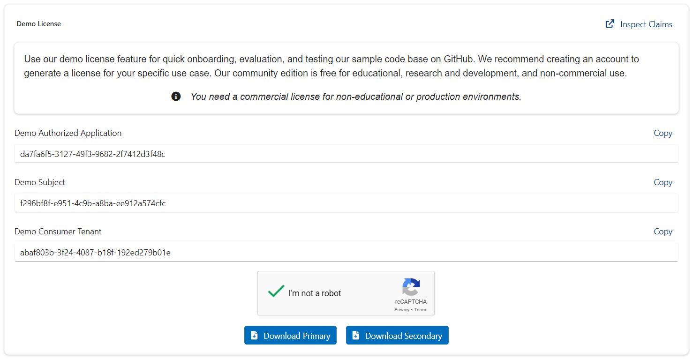

# Demo License
Use our demo license feature for quick onboarding, evaluation, and testing our sample code base on [GitHub](https://github.com/perpetualintelligence/docs/tree/main/samples/tutorials).

We recommend creating an account to generate a license for your specific use case. Our community edition is free for educational, research and development, and non-commercial use.

> **Note:** You need a paid commercial license for non-educational or production environments.

## How do I access demo license ?
You don't need an account to access or use the demo license. 

- Go to our [demo hosting](https://www.perpetualintelligence.com/products/pidemo/licensing) web page
- Verify the Google - reCAPTCHA
- Download the `Primary` or `Secondary` demo license keys



## How do I use demo license ?
You will need to configure your application by specifying the demo identifiers and primary or secondary demo license.

### Demo Authorized Application
This is your authorized application identifier or `auth_apps` claim for demo purposes. Copy it and specify it in your application configuration.

Example:
```
    options.Licensing.AuthorizedApplicationId = "da7fa6f5-3127-49f3-9682-2f7412d3f48c";
```

### Demo Subject
This is your subject or subscription id `sub` claim for demo purposes. Copy it and specify it in your application configuration.

Example:
```
    options.Licensing.Subject = "f296bf8f-e951-4c9b-a8ba-ee912a574cfc";
```

### Demo Consumer Tenant
This is your consumer tenant id `tid` claim for demo purposes. Copy it and specify it in your application configuration.

Example:
```
    options.Licensing.ConsumerTenantId = "abaf803b-3f24-4087-b18f-192ed279b01e";
```

### Demo License Key
These are your primary or secondary license keys for demo purposes. Download the primary or secondary file and specify its location in your application configuration.

> **Note:** You need to specify either primary or secondary.

Example:
```
    options.Licensing.KeySource = SaaSKeySources.JsonFile;
    options.Licensing.LicenseKey = "D:\\lic\\demo_primary.json"
```

```
    options.Licensing.KeySource = SaaSKeySources.JsonFile;
    options.Licensing.LicenseKey = "D:\\lic\\demo_secondary.json"
```

## See also
- [Options](../pi-cli/options.md)
