# Concepts
This document introduces all the technical concepts within the `pi-cli` terminal framework. It covers fundamental components and their roles in command parsing, routing and execution.

```mermaid
stateDiagram
    classDef Movement font-style:italic;
    classDef Event fill:#f9f9f9,stroke:#333,stroke-width:1px,font-style:italic,fill:#e6e6e6

    Terminal : Terminal Application
    HostedService : Hosted Service
    TerminalRouter : Terminal Router
    CommandRouter : Command Router
    PreRouteEvent : Pre-Route
    CommandParser : Command Parser
    RouteParser : Parse Route
    CommandHandler : Command Handler
    CheckLicense : Check License Limits
    CommandChecker : Command Checker
    PreCheckEvent : Pre-Check
    CheckCommand : Check Command
    PostCheckEvent : Post-Check
    CommandRunner : Command Runner
    PreRunEvent : Pre-Run
    RunCommand : Run Command
    ProcessResult : Process Run Result
    PostRunEvent : Post-Run
    PostRouteEvent : Post-Route
    Cancelled : Terminal Router Cancelled ?

    [*] --> Terminal
    Terminal --> HostedService 
    HostedService --> TerminalRouter
    TerminalRouter --> CommandRouter
    state CommandRouter {
        PreRouteEvent --> CommandParser

        state CommandParser {
            RouteParser
        }
        
        CommandParser --> CommandHandler
        state CommandHandler {
            CheckLicense --> CommandChecker
            state CommandChecker{
                PreCheckEvent --> CheckCommand
                CheckCommand --> PostCheckEvent
            }
            CommandChecker --> CommandRunner
            state CommandRunner {
                PreRunEvent --> RunCommand
                RunCommand --> ProcessResult
                ProcessResult --> PostRunEvent
            }
        }
        CommandHandler --> PostRouteEvent
    }
    CommandRouter --> Cancelled
    Cancelled --> TerminalRouter : NO
    Cancelled --> [*]
```

The flow initiates at the `Terminal`, representing the entry point of the application. 
Commands are then passed to the HostedService, which handles the hosting of the application, and subsequently to the TerminalRouter. This router is crucial in directing commands to their respective destinations. The CommandRouter then takes over, triggering the Pre-Route Event before parsing the command through CommandParser. Here, the RouteParser breaks down the command route into actionable segments.

Within the CommandRouter, the CommandHandler manages the execution logic. It involves steps like CheckLicense for verifying command's compliance with licensing requirements, and CommandChecker, where events like Pre-Check and Post-Check ensure command integrity. Once verified, CommandRunner executes the command, encapsulating stages from Pre-Run to Post-Run, processing the command result. Eventually, the flow reaches Post-Route Event, signifying the end of the command's journey, unless the router is Cancelled, in which case, it loops back to the TerminalRouter or ends the process.