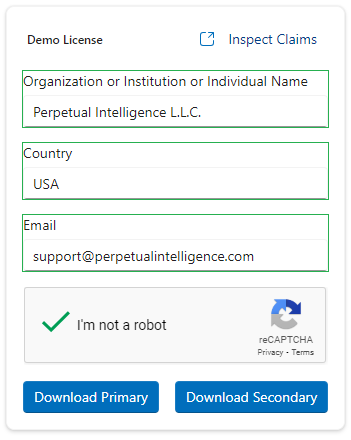

# Demo License

Utilize our demo license for quick onboarding, evaluation, and testing of our [samples](samples.md). While the demo license is freely accessible for educational, research, and non-production purposes, we suggest creating an account to obtain a license that best suits your specific requirements.

> **Note:** Educational institutions are eligible for a complimentary full-featured license for non-commercial purposes. To initiate the registration process, please [contact us](https://github.com/perpetualintelligence/support/issues).


## How do I get a demo license?
You don't need an account to access or use the demo license.

1. Navigate to the [demo license page](https://www.perpetualintelligence.com/products/onedemo).
2. Complete the form with the required basic information.
3. Verify your identity with Google reCAPTCHA.
4. Click `Get Demo License` to generate your demo license.


5. Download your demo license keys, choosing either `Download Primary` or `Download Secondary`.



## How do I use the demo license?
To incorporate the demo license into your application, you'll need to configure several settings.

You'll first need to specify the demo identifiers using the [LicensingOptions](xref:PerpetualIntelligence.Terminal.Configuration.Options.LicensingOptions). The required demo identifiers are available under the following namespace:

```csharp
using PerpetualIntelligence.Shared.Licensing;
```

### Demo Authorized Application
This is your authorized application identifier or `auth_apps` claim for demo purposes. Copy it and specify it in your application configuration.

Example:
```csharp
    options.Licensing.AuthorizedApplicationId = DemoIdentifiers.TerminalDemoAuthorizedApplicationId;
```

### Demo Subject
This is your subscription id or `sub` claim for demo purposes. Copy it and specify it in your application configuration.

Example:
```csharp
    options.Licensing.Subject = DemoIdentifiers.TerminalDemoSubject;
```

### Demo Consumer Tenant
This is your consumer tenant id or `tid` claim for demo purposes. Copy it and specify it in your application configuration.

Example:
```csharp
    options.Licensing.ConsumerTenantId = DemoIdentifiers.TerminalDemoConsumerTenantId;
```

### Demo License Key
These are your primary or secondary license keys for demo purposes. Download the primary or secondary file and specify its location in your application configuration.

> **Note:** You need to specify either primary or secondary.

Example:
```csharp
    // Download the license file in this location or specify your location
    options.Licensing.LicenseKey = "C:\\lic\\demo_primary.json"; 
```

Or

```csharp
    // Download the license file in this location or specify your location
    options.Licensing.LicenseKey = "C:\\lic\\demo_secondary.json";
```

## See also
- [Configuration Options](../configuration-options.md)
- [LicensingOptions](xref:PerpetualIntelligence.Terminal.Configuration.Options.LicensingOptions)
- [DemoIdentifiers](xref:PerpetualIntelligence.Shared.Licensing.DemoIdentifiers)
