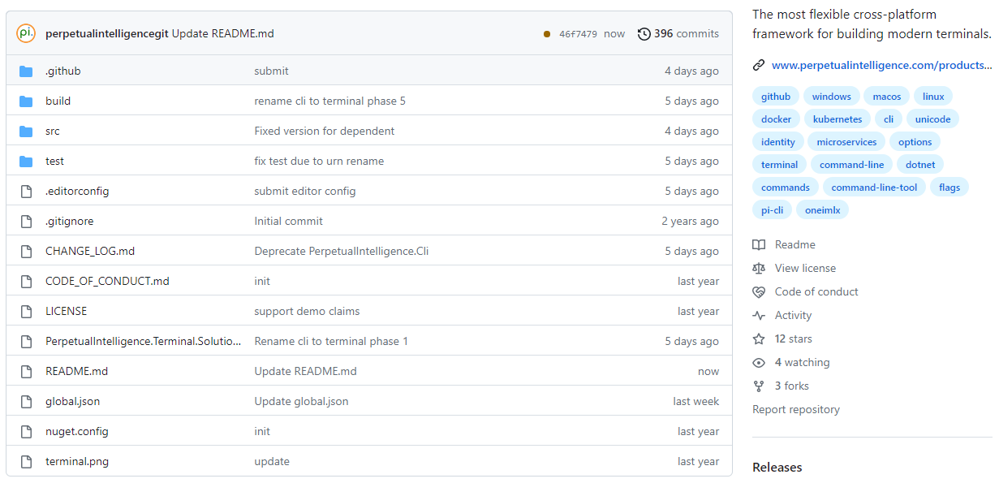

# Overview

## What is terminal?
`pi-cli` is the most flexible cross-platform framework for building modern terminals. 

Build enterprise-grade unicode terminals for your company, product, service, or developer tools. We support customers across engineering, manufacturing, semiconductors, technology, hardware, software, automation, digital industries, artificial intelligence, machine learning, finance, media, and creative design. 

Start with simple terminal apps with a few flags or build advanced terminals with groups, sub-commands, arguments, and options.

> ***Take your app or service to the command line with Unicode support and build terminals in a user language of your choice.***

## Craftsmanship
We crafted the `pi-cli` framework to be cross-platform, modular,  deployment agnostic, and fully customizable. [.NET](https://dotnet.microsoft.com/en-us/learn/dotnet/what-is-dotnet) provides a rich set of [DDD](https://docs.microsoft.com/en-us/dotnet/architecture/microservices/microservice-ddd-cqrs-patterns/ddd-oriented-microservice) tools and languages. `pi-cli` directly supports the .NET (traditional), .NET Standard, .NET6+ (.NET Core), and ASP.NET Core. It lets enterprises build ground-up terminals or migrate their existing console apps to terminals. Thus it is the de-facto standard in developing cross-platform terminals for your apps, services, and developer tools in the entire .NET ecosystem.

- Build and configure your terminal using microservices-based architecture principles, Dependency Injection(DI services), and options pattern.
- Use default handlers or provide custom implementations to handle terminal UX, command parsing, error handling, command validations, storage, and type checking.
- Use default console routing, default TCP/IP client-server routing, or define your custom HTTP, Named-Pipes, or gRPC routing.
- Provide self-hosting implementations for stores and hosts in an environment of your choice, e.g., Windows, Linux, macOS, Docker, Kubernetes, etc. 
- Build deployment agnostic terminals with all dependencies, test them in local environments, and deploy the production terminals on-premise, cloud (public, private, or government), or hybrid.
- Enable enterprise-grade secured terminal applications for your products and services similar to [Github CLI](https://cli.github.com/), [.NET CLI](https://docs.microsoft.com/en-us/dotnet/core/tools/), [Stripe CLI](https://stripe.com/docs/stripe-cli) or terminals with custom formats.
- Collaborate in an open-source environment, troubleshoot issues, and provide your feedback on the features and documentation
- Use [demo license](https://docs.perpetualintelligence.com/articles/onedemo/intro.html) for quick onboarding, testing, and evaluating ready-to-use samples on GitHub. No account is needed.

The framework handles the entire terminal infrastructure, so your focus is building modern terminal apps and services.

> ***In short, if what you want to achieve is doable in the .NET ecosystem, it is possible with `pi-cli`.***

## Open Source
Our entire source code is on [GitHub](https://github.com/perpetualintelligence/terminal). It enables community collaboration, troubleshoot issues, and helps get us your feedback on the features and documentation. It also promotes a better understanding of architecture and design.

> ***See our [licenses](licensing/intro.md) and [pricing](https://www.perpetualintelligence.com/products/terminal#pricing).***

## OS
Our DevOps builds the framework with Github [hosted runners](https://docs.github.com/en/actions/using-github-hosted-runners/about-github-hosted-runners) for the following OS platform. However, it supports all the additional platforms that .NET supports.

## Packaging
The licensed libraries can be accessed via Nuget:

## Repo
The [GitHub](https://github.com/perpetualintelligence/terminal) repo contains the artifacts to build, test and publish the `pi-cli` source.

 

## Terminal UX
The `pi-cli` framework does not enforce any specific terminal UX experience because this is always custom to the project. However, we provide you with a hosted service to manage the terminal application lifetime and UX customization.
- [TerminalHostedService](xref:PerpetualIntelligence.Terminal.Hosting.TerminalHostedService)

## Classes
[Classes and Object browser](../../api/index.md)

## Learn to Use
With the `pi-cli` framework, you don't have to be a microservices or distributed systems expert to build a modern and scalable terminal apps. You create and learn as you go on, and eventually, you become an expert :) similar to an [eventually-consistent system](https://docs.microsoft.com/en-us/dotnet/architecture/microservices/architect-microservice-container-applications/distributed-data-management). Build terminals for simple use cases, terminals that provides complex commands or options, or terminals that interact with a complex distributed system via protected APIs. We believe in agile development and agile learning. So, pick a learning model that works for you!

### I want to explore the samples on GitHub
- Use our [demo license](../onedemo/intro.md) for quick onboarding, evaluation, and testing sample code base on [GitHub](https://github.com/perpetualintelligence/docs/tree/main/samples)
- No account is needed

### I want to create my first modern terminal
- Start by [subscribing or buying](../buying/intro.md) the `pi-cli` framework.
- Pick a pricing plan that works for you.
- Activate your subscription on our [Consumer Portal](https://consumer.perpetualintelligence.com/).
- Generate your online, offline, dev, or on-premise [license keys](licensing/licensekeys.md).
- Browse our [read-to-use templates and tutorials](../samples.md).
- Build, debug, and learn the concepts as you go.
- We can't wait to see the fantastic terminals you build!

### I want to understand the concepts first
Continue reading, and we will explain all the concepts. We recommend you get familiar with the typical architectural principles first. They enable our framework to be extensible, customizable and remain scalable.

- [Dependency Injection](https://docs.microsoft.com/en-us/dotnet/core/extensions/dependency-injection)
- [Dependency Inversion](https://docs.microsoft.com/en-us/dotnet/architecture/modern-web-apps-azure/architectural-principles#dependency-inversion)
- [Options Patterns](https://docs.microsoft.com/en-us/dotnet/core/extensions/options)
- [Separation of concerns](https://docs.microsoft.com/en-us/dotnet/architecture/modern-web-apps-azure/architectural-principles#separation-of-concerns)
- [Single Responsibility](https://docs.microsoft.com/en-us/dotnet/architecture/modern-web-apps-azure/architectural-principles#separation-of-concerns)
- [Bounded Context](https://docs.microsoft.com/en-us/dotnet/architecture/modern-web-apps-azure/architectural-principles#bounded-contexts)

## Code Samples and Tutorials
Our [ready-to-use templates](https://github.com/perpetualintelligence/docs/tree/main/samples/templates/terminal) and [sample tutorials](https://github.com/perpetualintelligence/docs/tree/main/samples/tutorials/terminal) will get you started in no time.

## Licensing and Pricing
The software license and pricing model is flexible and fits all, whether you are a developer, solo entrepreneur, small-medium business, large enterprise, or a service vendor.
- [Licensing](licensing/intro.md)
- [Pricing](https://perpetualintelligence.com/products/terminal#pricing)

## Issues and feature requests
Please report [issue or feature request](https://github.com/perpetualintelligence/picli/issues) directly on our official github repo.

## References
- [Microservices](https://github.com/dotnet/docs/tree/main/docs/architecture/microservices)
- [.NET application architecture](https://docs.microsoft.com/en-us/dotnet/architecture/)
