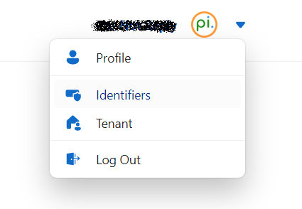
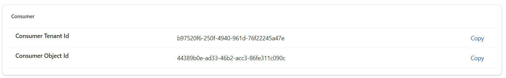
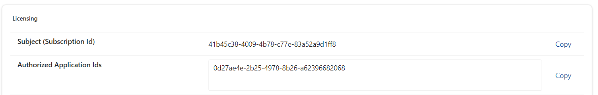

# Usage and Authorization

You authorize your terminal or application to use the `pi-cli` framework by configuring the [LicensingOptions](xref:PerpetualIntelligence.Terminal.Configuration.Options.LicensingOptions).

# Identifiers
The identifiers help identify and configure your terminal or application correctly.

1. Go to our [Consumer Portal](https://consumer.perpetualintelligence.com/)
2. **Login** to your account
3. Go to **Identifiers** in your accounts menu

4. Scroll down to **Consumer** section

5. Copy `Consumer Tenant Id`
6. Scroll down to **Licensing** section

7. Copy `Subject Id (Subscription Id)`
8. Copy `Authorized Application Id`
9. Configure the copied identifiers in your CLI terminal options

```
    options.Licensing.AuthorizedApplicationId = "<Your copied authorized application id>";
    options.Licensing.Subject = "<Your copied subject id>";
    options.Licensing.ConsumerTenantId = "<Your copied consumer tenant id>";
```

## License Keys
Download your primary or secondary license key as explained in the [License Keys](licensekeys.md) topic. The downloaded file is a JSON file with license audience claims and licenses keys.

> **Note:** You need to specify either primary or secondary.

```
    options.Licensing.KeySource = SaaSKeySources.JsonFile;
    options.Licensing.LicenseKey = "<Your license key file path>"
```

## See also
- [Options](../../picli/options.md)