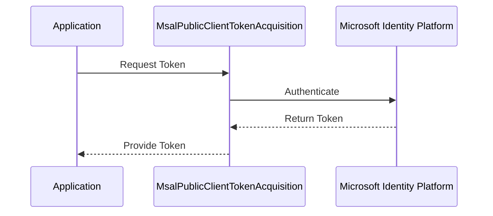

# Authentication

## Introduction

The `OneImlx.Terminal.Authentication` extends the `OneImlx.Terminal` framework to include authentication capabilities for your terminal applications.


It integrates with Microsoft's Authentication Library (MSAL) and supports the development of secure CLI and terminal applications.

## Key Components

### Extensions
- **ITerminalBuilderExtensions.cs**: Contains extension methods for `ITerminalBuilder`. These methods integrate authentication handlers and token acquisition services into the application service pipeline.

### MSAL
- **IMsalTokenAcquisition.cs**: Interface for token acquisition, standardizing the token fetching and refreshing process.
- **MsalAccessTokenProviderDelegatingHandler.cs**: Delegating handler that appends access tokens to HTTP requests to authenticate outgoing requests.
- **MsalAuthenticationProviderDelegatingHandler.cs**: Delegating handler that manages the providing of credentials for outgoing requests.
- **MsalKiotaAuthProvider.cs**: Implements the authentication provider interface for applications interacting with Microsoft Graph, using MSAL.
- **MsalPublicClientTokenAcquisition.cs**: Manages token acquisition for applications that require user interaction.

## Detailed Functionality

### MSAL Public Client Token Acquisition

`MsalPublicClientTokenAcquisition` manages authentication tokens for applications requiring user interaction. The class supports desktop and mobile applications. The sequence diagram below illustrates the token acquisition process:



### Extending Terminal Builder

`ITerminalBuilderExtensions` enables the integration of MSAL-based authentication into the terminal builder configuration. Developers can use these extensions to customize and incorporate authentication mechanisms as needed.

## Configuration Example

To configure MSAL authentication in a terminal application, define the client ID and tenant ID in the service configuration:

```csharp
public void ConfigureServices(IServiceCollection services)
{
    services.AddMsalAuthentication(options =>
    {
        options.ClientId = "your-client-id";
        options.TenantId = "your-tenant-id";
    });
}
```

## Testing and Validation

Developers should verify the authentication flow by:
- Testing scenarios where token acquisition fails.
- Checking that tokens refresh correctly.
- Confirming that all protected endpoints reject unauthenticated requests.

## Best Practices

- **Secure Storage**: Store sensitive information such as client secrets and tokens securely.
- **Logging and Monitoring**: Implement logging and monitoring to identify and respond to authentication failures.

## Conclusion

`OneImlx.Terminal.Authentication` facilitates the integration of secure authentication mechanisms into terminal applications, supporting the use of MSAL and other identity providers.
