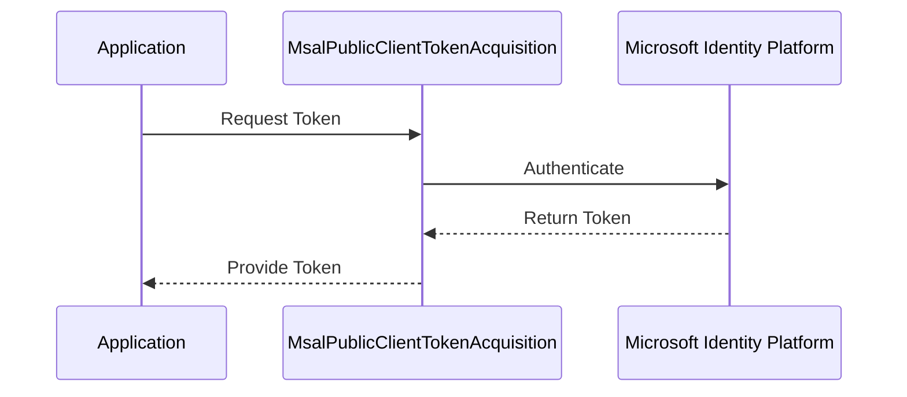

# Authentication

## Introduction

The `OneImlx.Terminal.Authentication` extends the `OneImlx.Terminal` framework to include authentication capabilities for your terminal applications. This package emphasizes a secure, zero-trust architecture and compliance with OAuth and OpenID Connect (OIDC) standards.

> Note: The `OneImlx.Terminal.Authentication` is a preview release. Features and implementations are subject to change.

Currently we integrate with Microsoft's Authentication Library (MSAL) and supports the development of secure CLI, terminal applications and servers. In future we plan to support other IdP such as IdentityServer, Google Authentication etc.

## Key Components

- **ITerminalBuilderExtensions.cs**: Contains extension methods for `ITerminalBuilder`. These methods integrate authentication handlers and token acquisition services into the application service pipeline.

### MSAL
- **IMsalTokenAcquisition.cs**: Interface for token acquisition, standardizing the token fetching and refreshing process.
- **MsalAccessTokenProviderDelegatingHandler.cs**: Delegating handler that appends access tokens to HTTP requests to authenticate outgoing requests.
- **MsalAuthenticationProviderDelegatingHandler.cs**: Delegating handler that manages the providing of credentials for outgoing requests.
- **MsalKiotaAuthProvider.cs**: Implements the authentication provider interface for applications interacting with Microsoft Graph, using MSAL.
- **MsalPublicClientTokenAcquisition.cs**: Manages token acquisition for applications that require user interaction.

### MSAL Public Client Token Acquisition

`MsalPublicClientTokenAcquisition` manages authentication tokens for applications requiring user interaction. The class supports desktop and mobile applications. The sequence diagram below illustrates the token acquisition process:

