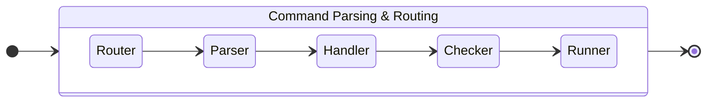

## [Command](xref:OneImlx.Terminal.Commands.Command)
A command in the `OneImlx.Terminal` framework represents a specific action or set of actions performed by your application. Immutable for consistency and stability, commands can range from simple method invocations to complex operations across networks. They are central to any operation within your application or service.

## [Command Descriptor](xref:OneImlx.Terminal.Commands.CommandDescriptor)
The command descriptor defines a command's identity, including its arguments and options. It can be a root, group, sub-command, or a native command. This structure helps developers organize commands in a clear and intuitive way.

### Root Command
A root command is the top terminal command. It can represent your organization, a product, or a service. 
  
For instance, 
- GitHub CLI [gh](https://cli.github.com/manual/gh) is an example of an organization root command.
- Microsoft however, uses [dotnet](https://docs.microsoft.com/en-us/dotnet/core/tools/dotnet) as a driver application for the .NET CLI. 

#### Grouped Command
A grouped command provides a context for a set of related sub-commands. 

For instance,
- Github CLI [gh auth](https://cli.github.com/manual/gh_auth), `auth` is an example of a grouped command to authenticate gh and git with GitHub. 

#### Sub Command
A subcommand is an individual executable command that performs a specific action. 

For instance,
- Github CLI [gh auth login](https://cli.github.com/manual/gh_auth_login), `login` is an example of a subcommand that authenticates with GitHub host.
- [dotnet build](https://docs.microsoft.com/en-us/dotnet/core/tools/dotnet-build), `build` is a sub-command that builds a project and all of its dependencies.

#### Native Command
A native command is an individual executable command that performs a specific native action and it is not bound by the command hierarchy

For instance,
- run "mkdir hello", runs the native OS command and creates a directory.
- clear, clears the terminal screen.

## [Argument](xref:OneImlx.Terminal.Commands.Argument)
Arguments within the raw command string are provided directly as values, following a specific sequence when the command supports multiple arguments. Unlike options, which are defined as key-value pairs, arguments are enumerated plainly without keys.

Example:
```
copy "/path/to/source" "/path/to/destination"
```

In this example for a `copy` command, *the* source and destination paths are the arguments provided directly in the required order.

## [Option](xref:OneImlx.Terminal.Commands.Option)
Options within the raw command string are specified as key-value pairs and are order-independent, providing flexibility in how commands are structured. Each option is identified by its key, and can also be referred to by its alias, if one is defined.

Example:
```
copy "/path/to/source" "/path/to/destination" --recursive -o "/path/to/log"
```

## [Raw](xref:System.String)
The raw command string represents the full command as entered by the user or passed by an application.

Example:
```
gh issue list
 
gh issue create --label bug
 
dotnet build --runtime ubuntu.18.04-x64
```

## [Parsed Command](xref:OneImlx.Terminal.Commands.Parsers.ParsedCommand)
The parsed command encapsulates the parsed command, and optionally, the command hierarchy.

## [Data Mapper](xref:OneImlx.Terminal.Commands.Checkers.DataTypeMapper`1)
The framework provides a data type mapping interface for converting configuration options into their correct data types, crucial for executing commands. The default `DataTypeMapper<TValue>` supports common data types such as integers, strings, and dates. Developers can also create custom mappers to handle specific or complex data types, enhancing the framework's flexibility and command processing precision.

## Parsing & Routing



### [Command Router](xref:OneImlx.Terminal.Commands.CommandRouter)
The command router orchestrates the workflow of command processing. It routes raw command string through several steps such as parsing the command string to understand its structure, extracting any arguments and options provided, checking for licensing requirements, and validating the integrity of the command. Once these steps are completed, the command router then automatically invokes the corresponding command runner to execute the command. This entire process is handled seamlessly by the command router.

### [Command Parser](xref:OneImlx.Terminal.Commands.Parsers.CommandParser)
The command parser in the `OneImlx.Terminal` framework is the default implementation responsible for interpreting raw command routes. It utilizes an @OneImlx.Terminal.Commands.Parsers.ICommandRouteParser to parse routes asynchronously, generating a @OneImlx.Terminal.Commands.Parsers.CommandParserResult containing the parsed command information. This default behavior ensures reliable and consistent command parsing within the framework. Developers have the option to customize the parsing logic to suit their specific needs, enabling them to extend or modify the parsing process for their terminal applications.

### [Command Handler](xref:OneImlx.Terminal.Commands.Handlers.CommandHandler)
The command handler manages the validation and execution of commands within a terminal application. It oversees essential tasks such as license verification, command checking, command execution, and event management, ensuring efficient processing of commands. With customizable configurations and built-in mechanisms for command validation and execution, the command handler empowers developers to seamlessly integrate command-driven functionalities into their applications.

### [Command Checker](xref:OneImlx.Terminal.Commands.Checkers.CommandChecker)
The command checker in the `OneImlx.Terminal` framework ensures that commands are valid before they're executed. It checks things like whether required arguments and options are provided, ensuring commands follow the defined rules. This helps make command processing more reliable and error-free.

The default @OneImlx.Terminal.Commands.Checkers.CommandChecker provided by the framework handles basic checks such as verifying the presence of required arguments and options, detecting obsolete attributes, and ensuring disabled elements are not used. Developers have the option to implement custom command checkers either for the entire terminal application or for individual commands, allowing for tailored validation logic to suit specific requirements.

### [Command Runner](xref:OneImlx.Terminal.Commands.Runners.CommandRunner`1)
The command runner is where developers implement how commands are executed. It operates asynchronously to handle commands that might take a while to process. The framework routes each parsed command to its specific runner, helping to organize and manage the command execution logic within your application.
