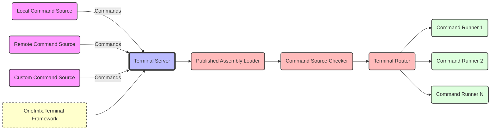

# Integration
The `OneImlx.Terminal` framework is designed to support the integration of command sources that can be either local or remote, enabling dynamic loading of commands at runtime. This facilitates the update and expansion of terminal capabilities without restarting the application, providing operational flexibility and adaptability.

## Terminal Command Source
The @OneImlx.Terminal.Integration.ITerminalCommandSource`1 is a local or remote provider of terminal commands. The framework includes an assembly loader command source by default, which dynamically loads assemblies containing command runners. This integration allows seamless addition of both first-party and third-party command sources, significantly enhancing the terminal's responsiveness to new operational demands.

## Terminal Command Source Checker
The @OneImlx.Terminal.Integration.ITerminalCommandSourceChecker`1  checks the integrity and authenticity of the command source before loading. Developers must implement robust checking mechanisms to mitigate risks such as code injection or execution of untrusted code.

## Published Command Source
The default @OneImlx.Terminal.Integration.PublishedCommandSource loads terminal commands from assemblies located in published directories. This method handles both local and network-based locations. This setup allows updates or extensions to terminal commands without altering the core application. 

>Note: Only trusted sources should provide dynamically loaded assemblies.

## Published Assembly Loader
The defualt @OneImlx.Terminal.Integration.PublishedAssemblyLoader simplifies the process of loading command source assemblies from specific contexts. It ensures each assembly is loaded only once, preventing duplication and reducing potential conflicts between different versions of the same assembly or its dependencies. However, this basic implementation does not address complex scenarios such as managing version conflicts or dependencies across different dependency trees. For applications with more sophisticated needs in conflict resolution and dependency management, developers are encouraged to design a custom loader that better fits their specific requirements.
