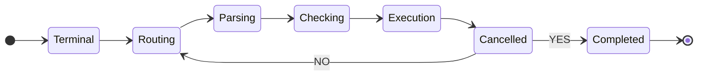

# Introduction

The `OneImlx.Terminal` aka `OneTerminal` framework introduces the following packages.

| Package | Description | Usage |
|---------|-------------|-------|
| [`OneImlx.Terminal.Shared`](https://www.nuget.org/packages/OneImlx.Terminal.Shared) | The cross-platform shared library for the `OneImlx.Terminal` framework. | Referenced by all terminal packages as a base dependency, do not use in your application code directly. |
| [`OneImlx.Terminal`](https://www.nuget.org/packages/OneImlx.Terminal) | The cross-platform framework for building modern and secured terminal apps, servers, and AI agents. | Build full end-to-end terminal applications with command processing and execution. |
| [`OneImlx.Terminal.Authentication`](https://www.nuget.org/packages/OneImlx.Terminal.Authentication) | A cross-platform authentication package for securing `OneImlx.Terminal` applications. | Build an authentication layer using MSAL for the terminal applications. |
| [`OneImlx.Terminal.Server`](https://www.nuget.org/packages/OneImlx.Terminal.Server) | A cross-platform hosting framework for `OneImlx.Terminal` server apps and AI agents, with ASP.NET Core hosting. | Build terminal apps, servers, and AI agents that support TCP, UDP, gRPC, HTTP routers for service-to-service or agent-to-agent communications. |
| [`OneImlx.Terminal.Client`](https://www.nuget.org/packages/OneImlx.Terminal.Client) | The cross-platform client library for the `OneImlx.Terminal` framework. | Build terminal client apps or an AI agent that talks to terminal servers. |

The diagram below outlines the high-level phases of command routing in the framework:

## Supported Flows

The framework supports a range of communication and execution flows:

- **Manual Interactive Flow**  
  A user interacts directly with a terminal application via a command-line interface (CLI). Commands are typed and executed interactively.

- **Client-to-Server Flow**  
  A terminal client sends commands to a terminal server over supported protocols such as TCP, HTTP, gRPC, or UDP. Useful for remote execution or centralized processing.

- **Service-to-Service Flow**  
  One backend service communicates with another terminal-enabled service using the terminal protocol. Common in distributed systems and microservice architectures.

- **Agent-to-Agent Flow**  
  Autonomous agents issue commands to each other using the terminal as the execution layer. This enables collaborative, task-driven behavior between AI agents.
