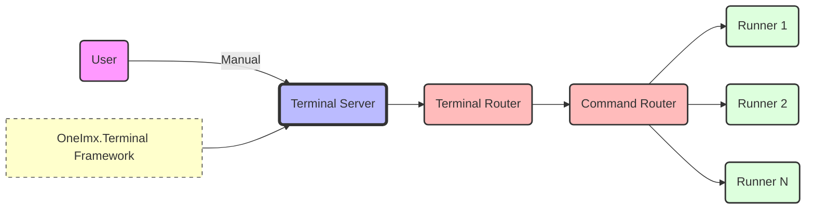
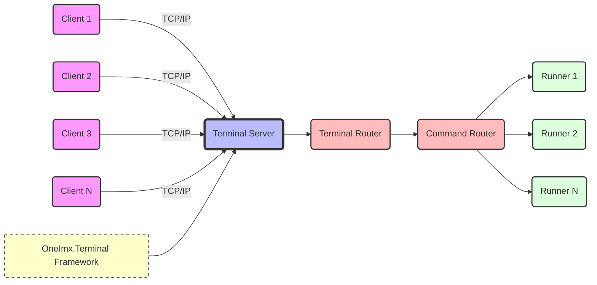
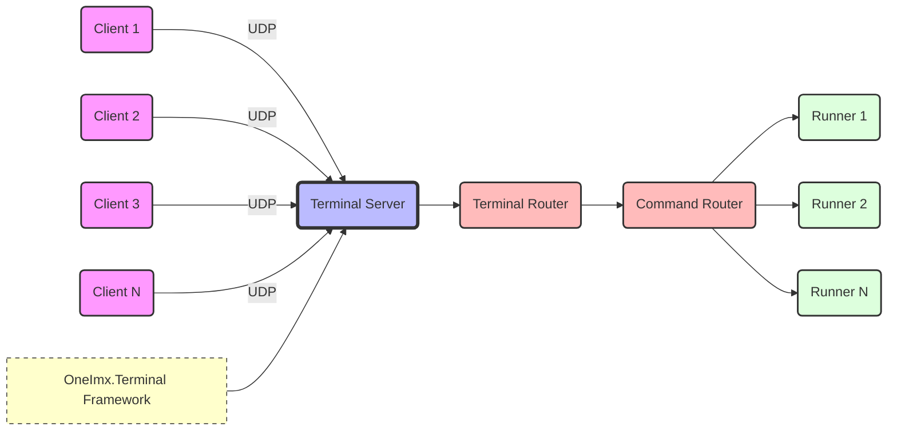
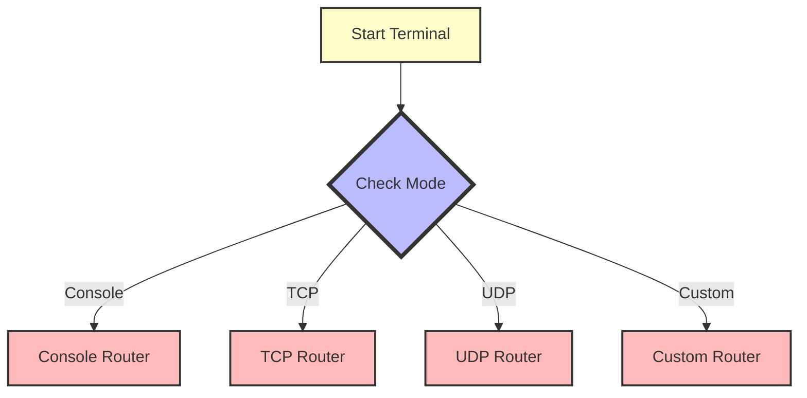

# Terminal Routers
The `OneImx.Terminal` framework uses routers to direct commands from users or services. This article summarizes the terminal routers designed to abstract and simplify the integration of various communication protocols within .NET for `OneImx.Terminal` applications.

## Terminal Console Router
The framework supports @OneImlx.Terminal.Runtime.TerminalConsoleRouter that allows end-users to manually enter commands into your terminal application. It ensures that commands entered by the user are routed to the appropriate command runners for execution.

**Note:** In this context, `console` refers to an abstraction of console routing, meaning the console can be a standard system console, a desktop application, or a web-based console.

```csharp
// Setup the terminal context and run the router indefinitely as a console.
TerminalStartContext terminalStartContext = new(TerminalStartMode.Console, terminalTokenSource.Token, commandTokenSource.Token);
TerminalConsoleRouterContext consoleRouterContext = new(terminalStartContext);
await host.RunTerminalRouterAsync<TerminalConsoleRouter, TerminalConsoleRouterContext>(consoleRouterContext);
```

Console-based routing is particularly useful in environments where manual input and immediate command execution are necessary, offering a direct interface for administrators or users to interact with the system.



## Terminal TCP Router
The framework supports @OneImlx.Terminal.Runtime.TerminalTcpRouter that allows terminal applications to function as servers, capable of receiving commands over TCP/IP from multiple clients concurrently. It ensures that commands are efficiently routed to the appropriate terminal runners, enabling effective command processing and response handling back to clients."

```csharp
// Setup the terminal context and run the router as a TCP server indefinitely
TerminalStartContext terminalStartContext = new(TerminalStartMode.Tcp, terminalTokenSource.Token, commandTokenSource.Token);
TerminalConsoleRouterContext consoleRouterContext = new(terminalStartContext);
await host.RunTerminalRouterAsync<TerminalTcpRouter, TerminalTcpRouterContext>(consoleRouterContext);
```

The standard [.NET TCP/IP classes](https://learn.microsoft.com/en-us/dotnet/fundamentals/networking/sockets/tcp-classes) provide the infrastructure for reliable delivery of streams of data between applications. This makes it suitable for applications that require robust communication capabilities, such as those involving hardware interfaces, client-server or service-service architectures.



## Terminal UDP Router
The framework supports @OneImlx.Terminal.Runtime.TerminalUdpRouter that allows terminal applications to function as servers, capable of receiving commands over UDP from multiple clients concurrently. It ensures that commands are efficiently routed to the appropriate terminal runners.

```csharp
// Setup the terminal context and run the router as a UDP server indefinitely
TerminalStartContext terminalStartContext = new(TerminalStartMode.Udp, terminalTokenSource.Token, commandTokenSource.Token);
TerminalConsoleRouterContext consoleRouterContext = new(terminalStartContext);
await host.RunTerminalRouterAsync<TerminalUdpRouter, TerminalUdpRouterContext>(consoleRouterContext);
```

The standard [.NET UDP classes](https://learn.microsoft.com/en-us/dotnet/framework/network-programming/using-udp-services) provide the infrastructure for datagram-based communications that do not require a connection before data is sent. This makes it suitable for applications that require lightweight, low-latency communication, such as real-time data feeds or multimedia streaming.



## Terminal Custom Router
The `OneImx.Terminal` framework also supports custom routers via @OneImlx.Terminal.Runtime.TerminalCustomRouter, allowing for specialized routing logic that may not be covered by standard TCP, UDP, or console routers. This flexibility supports unique application-specific routing needs that require customized behavior beyond standard protocol handling.

```csharp
// Setup the terminal context and run a custom router based on specific requirements
TerminalStartContext terminalStartContext = new(TerminalStartMode.Custom, terminalTokenSource.Token, commandTokenSource.Token);
TerminalCustomRouterContext customRouterContext = new(terminalStartContext);
await host.RunTerminalRouterAsync<MyTerminalCustomRouter, MyTerminalCustomRouterContext>(customRouterContext);
```

## Mixed Mode Terminal Router
The framework support a mixed mode terminal router that allows developers to create terminals with multiple operational modes. Using startup arguments, terminals can be configured to operate in console mode for user interactions, as a TCP/UDP server for handling network commands, or a custom router tailored to specific needs.

Developers can pass the desired operational mode using startup arguments during the application launch. The `Main` method of the terminal application then processes these arguments to initiate the appropriate mode.

For instance, a terminal application can be configured to start in console mode directly by a user to execute commands manually. Alternatively, when started in TCP or UDP mode, it enables the application to accept commands remotely from other services or networked clients, effectively serving as a backend server.

> **Important:** Once the terminal router is configured at startup, it cannot be changed during runtime.



## Selecting a Router
Choosing the right router depends on your application's specific communication needs, including factors such as reliability, speed, bidirectional communication, and message brokering capabilities. Each router in the `OneImx.Terminal` framework abstracts the underlying protocol complexities, providing a simplified interface for developers to integrate network communication features seamlessly into their applications.