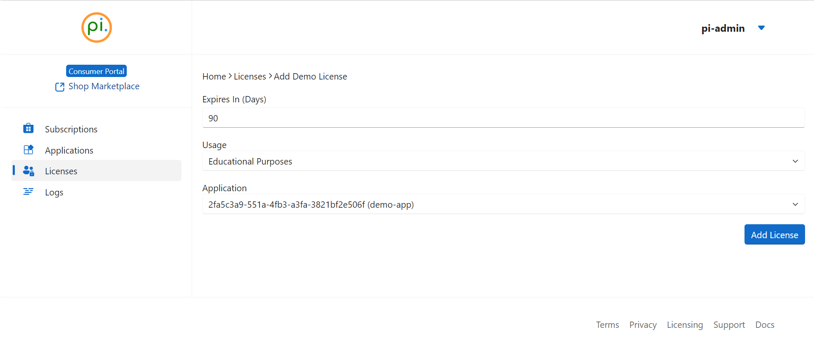
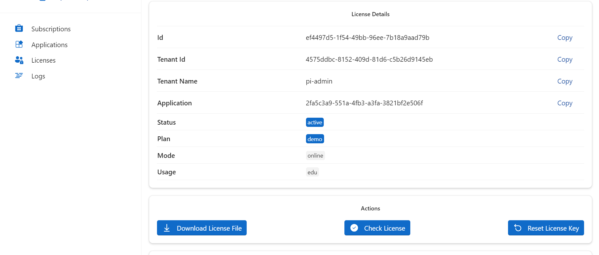

# Demo License
Use the demo license for quick onboarding, community or educational purposes.

## Acquiring a Demo License
Create an account on our [Consumer Portal](https://www.consumer.perpetualintelligence.com) to get your demo license.

1. **Sign In**: Go to your [account](https://www.consumer.perpetualintelligence.com/licenses).
2. **License Access**: Choose `Licenses` > `Add Demo License`.
3. **License Creation**: Enter the required details and select `Add License`.
   - 
4. **Download License**: Download the license file to your system.
   - 
5. **Integration**: Configure your terminal application with the demo license.

**Note:** Link each license to one or more applications. For creating an application for your terminal, visit [Applications](https://www.consumer.perpetualintelligence.com/applications) and click `Add Application`.

## Additional Resources
- [Configuration Options](../configurationoptions.md)
- [Licensing Options](xref:OneImlx.Terminal.Configuration.Options.LicensingOptions)
