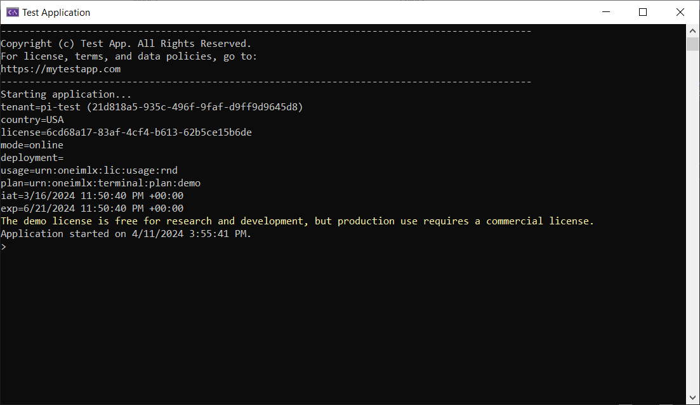
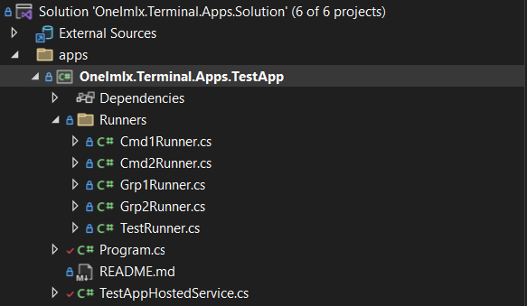
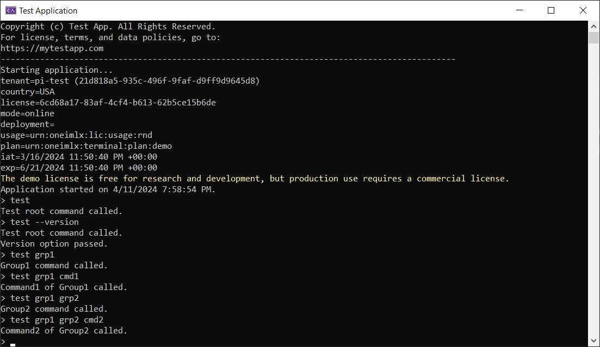

# Setup
Ensure you have your license file ready. Follow these steps to set up your terminal application with the `OneImlx.Terminal` framework.

## Test Application
Our test application demonstrates the `OneImlx.Terminal` framework. It's suitable for learning and building terminal applications.

### Summary
1. Browse [test application](https://github.com/perpetualintelligence/terminal/apps)
2. Clone the `apps` folder
3. Replace our internal development license with your demo or commercial license.
4. Remove the conditional `<ProjectReference>` in .csproj and use NuGet `<PackageReference>`.
5. Build and test the code

## Details

### 1. Install NuGet Packages
You install the framework through NuGet packages. The core functionality is available via the `OneImlx.Terminal` package. For scenarios requiring secured command execution, the `OneImlx.Terminal.Authentication` package extends the framework with authentication capabilities. You may choose either package based on your needs.

[](https://www.nuget.org/packages/OneImlx.Terminal)
[](https://www.nuget.org/packages/OneImlx.Terminal.Authentication)

Apart from that you will need the following NuGet packages:

[](https://www.nuget.org/packages/Microsoft.Extensions.Hosting)

> **Note**: Remove the entire `DEV CONFIG:` from the the .csproj file and add our NuGet package directly. The `<ProjectReference>` is for our internal development.

```
    <!--
        DEV CONFIG: REMOVE THIS SECTION IN YOUR APP AND ONLY ADD NUGET PACKAGE REFERENCE
    -->
    <Choose>
        <When Condition="'$(PI_CI_REFERENCE)'=='cross'">
            <ItemGroup>
                <ProjectReference Include="..\..\src\OneImlx.Terminal.Authentication\OneImlx.Terminal.Authentication.csproj" />
            </ItemGroup>
        </When>
        <Otherwise>
            <ItemGroup>
                <PackageReference Include="OneImlx.Terminal.Authentication" Version="5.10.1-rc.114243041" />
            </ItemGroup>
        </Otherwise>
    </Choose>
```

### 2. Add Hosted Service
The @OneImlx.Terminal.Hosting.TerminalHostedService is a hosted service that manages terminal lifetime, performs licensing and configuration checks, and enables terminal UX customization.

The below image shows the default console view when you run the test application.


You can customize the terminal behavior by overriding the methods from @OneImlx.Terminal.Hosting.TerminalHostedService.
```
using Microsoft.Extensions.Hosting;
using Microsoft.Extensions.Logging;
using OneImlx.Terminal.Configuration.Options;
using OneImlx.Terminal.Hosting;
using OneImlx.Terminal.Licensing;
using OneImlx.Terminal.Runtime;

namespace OneImlx.Terminal.Apps.TestApp
{
    /// <summary>
    /// The <see cref="TerminalHostedService"/> for the test app.
    /// </summary>
    public sealed class TestAppHostedService : TerminalHostedService
    {
        /// <summary>
        /// Initializes a new instance.
        /// </summary>
        /// <param name="serviceProvider">The DI service provider.</param>
        /// <param name="options">The terminal configuration options.</param>
        /// <param name="terminalConsole">The terminal console.</param>
        /// <param name="logger">The logger.</param>
        public TestAppHostedService(
            IServiceProvider serviceProvider,
            TerminalOptions options,
            ITerminalConsole terminalConsole,
            ILogger<TerminalHostedService> logger) : base(serviceProvider, options, terminalConsole, logger)
        {
        }

        /// <summary>
        /// Perform custom configuration option checks at startup.
        /// </summary>
        /// <param name="options"></param>
        /// <returns></returns>
        protected override Task CheckHostApplicationConfigurationAsync(TerminalOptions options)
        {
            return Task.CompletedTask;
        }

        /// <summary>
        /// The <see cref="IHostApplicationLifetime.ApplicationStarted"/> handler.
        /// </summary>
        protected override void OnStarted()
        {
            // These are async calls, but we are blocking here for as the  of the test.
            TerminalConsole.WriteLineAsync("Application started on {0}.", DateTime.UtcNow.ToLocalTime().ToString()).Wait();
        }

        /// <summary>
        /// The <see cref="IHostApplicationLifetime.ApplicationStopped"/> handler.
        /// </summary>
        protected override void OnStopped()
        {
            TerminalConsole.WriteLineColorAsync(ConsoleColor.Red, "Application stopped on {0}.", DateTime.UtcNow.ToLocalTime().ToString()).Wait();
        }

        /// <summary>
        /// The <see cref="IHostApplicationLifetime.ApplicationStopping"/> handler.
        /// </summary>
        protected override void OnStopping()
        {
            TerminalConsole.WriteLineAsync("Stopping application...").Wait();
        }

        /// <summary>
        /// Print <c>cli</c> terminal header.
        /// </summary>
        /// <returns></returns>
        protected override async Task PrintHostApplicationHeaderAsync()
        {
            await TerminalConsole.WriteLineAsync("---------------------------------------------------------------------------------------------");
            await TerminalConsole.WriteLineAsync("Copyright (c) Test App. All Rights Reserved.");
            await TerminalConsole.WriteLineAsync("For license, terms, and data policies, go to:");
            await TerminalConsole.WriteLineAsync("https://mytestapp.com");
            await TerminalConsole.WriteLineAsync("---------------------------------------------------------------------------------------------");

            await TerminalConsole.WriteLineAsync("Starting application...");
        }

        /// <summary>
        /// Print host application licensing information.
        /// </summary>
        /// <param name="license">The extracted license.</param>
        /// <returns></returns>
        protected override Task PrintHostApplicationLicensingAsync(License license)
        {
            // Print custom licensing info or remove it completely.
            return base.PrintHostApplicationLicensingAsync(license);
        }
    }
}
```

### 3. Setup Program.cs

The Main method in Program.cs sets up the `OneImlx.Terminal` framework and initiates the default console router, which then asynchronously processes and executes user-issued commands. It also configures cancellation tokens to terminate specific commands or the entire application as needed.

```
private static async Task Main(string[] args)
{
    // Allow cancellation for the entire terminal or individual commands.
    CancellationTokenSource terminaTokenSource = new();
    CancellationTokenSource commandTokenSource = new();

    // Setup and start the host builder.
    // Note: The host should only start, the terminal framework will run the router separately.
    IHostBuilder hostBuilder = CreateHostBuilder(args);
    hostBuilder.ConfigureServices(ConfigureServicesDelegate);
    hostBuilder.ConfigureLogging(ConfigureLoggingDelegate);
    IHost host = hostBuilder.Start();

    // Setup the terminal context and run the console router indefinitely.
    TerminalStartContext terminalStartContext = new(TerminalStartMode.Console, terminaTokenSource.Token, commandTokenSource.Token);
    TerminalConsoleRouterContext consoleRouterContext = new(terminalStartContext);
    await host.RunTerminalRouterAsync<TerminalConsoleRouter, TerminalConsoleRouterContext>(consoleRouterContext);
}
```

> Note: 
You can also configure your terminal as a server that employs TCP or UDP routers to process and execute commands in a service-to-service architecture.

### 4. Configure Services and Options
The `OneImlx.Terminal` framework leverages the modern Dependency Injection (DI) and Options pattern to streamline setup and customization.

#### Configure Logging
`ConfigureLoggingDelegate` acts as a customizable method for setting up logging. Below is an example showing how to configure [Serilog](https://serilog.net/) as the logging solution.

```
private static void ConfigureLoggingDelegate(HostBuilderContext context, ILoggingBuilder builder)
{
    // Clear all providers
    builder.ClearProviders();

    // Configure logging of your choice, here we are configuring Serilog
    var loggerConfig = new LoggerConfiguration();
    loggerConfig.MinimumLevel.Error();
    loggerConfig.WriteTo.Console();
    Log.Logger = loggerConfig.CreateLogger();
    builder.AddSerilog(Log.Logger);
}
```

#### Configure Services
`ConfigureServicesDelegate` acts as a customizable method for integrating all necessary services for your terminal application. To specifically configure the `OneImlx.Terminal` framework, utilize the `ConfigureOneImlxTerminal` method.

```
private static void ConfigureServicesDelegate(HostBuilderContext context, IServiceCollection services)
{
    // Disable hosting status message
    services.Configure<ConsoleLifetimeOptions>(options =>
    {
        options.SuppressStatusMessages = true;
    });

    // Configure OneImlx.Terminal services
    ConfigureOneImlxTerminal(services);
            
    // Configure other services
}
```

#### Configure Framework
`ConfigureOneImlxTerminal` configures the `OneImlx.Terminal` framework for console mode with a demo license. It registers a hosted service to manage the terminal's lifecycle, initializes HTTP client for demo license, and sets the licensed application identifier, license file path, and command prompt symbol.

> **Note:** Please ensure you set your application identifier and the path to your demo license.

For more information, see all the supported [terminal services](../configuration/services.md), [configuration options](../configuration/options.md) and [terminal routers](../concepts/routers.md)

```
private static void ConfigureOneImlxTerminal(IServiceCollection collection)
{
    // Configure the hosted service
    collection.AddHostedService<TestAppHostedService>();

    // We are using online license so configure HTTP client
    collection.AddHttpClient("demo-http");

    // Specific your demo or commercial license file.
    // Note: Replace with your license file.
    ITerminalBuilder terminalBuilder = collection.AddTerminalConsole<TerminalInMemoryCommandStore, TerminalUnicodeTextHandler, TerminalHelpConsoleProvider, TerminalSystemConsole>(new TerminalUnicodeTextHandler(),
        options =>
        {
            options.Id = TerminalIdentifiers.TestApplicationId;
            options.Licensing.LicenseFile = "C:\\lic\\demo.json";
            options.Router.Caret = "> ";
        }
    );

    // Add commands using declarative syntax
    terminalBuilder.AddDeclarativeAssembly<TestRunner>();
}
```

### 5. Add Descriptors and Runners
The test application includes a Runners folder that defines all the runners. Each runner defines a command descriptor, arguments, and options or flags.

You can use declarative syntax to define the descriptor's attributes directly on each command runner, or you can use explicit extension methods to register the command descriptor and runners.



### 6. Start Terminal Router
Building and launching the test application with the terminal console router completes the setup, a task already accomplished in the Main method.

The following image displays executing a test command from the user-entered command string.



### 7. Stop Terminal Router
You have several methods to stop the terminal router, either explicitly or programmatically:
- Send the standard `CTRL+C` signal to the hosted service/console.
- Define an `exit` command that triggers cancellation.
- Issue a cancellation token programmatically from within the application.
