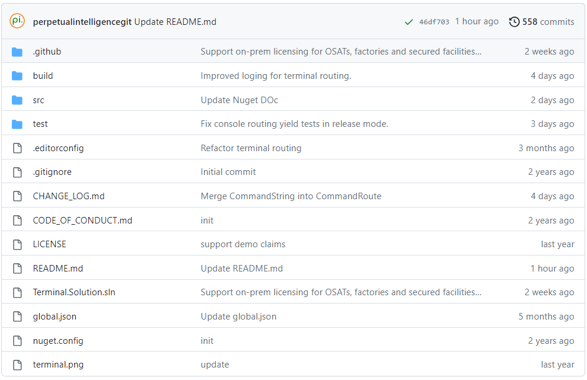

# Terminal Framework
`OneImlx.Terminal` is a cross-platform, adaptable framework designed for developing modern and secured terminal applications. It simplifies terminal infrastructure complexity, enabling developers to focus on building enterprise-grade terminal applications with Unicode support and extensive command hierarchies.

- Utilize microservices architecture, Dependency Injection (DI), and options pattern to design and configure your terminal apps.
- Access built-in features or develop your own solutions for terminal UX, input parsing, error handling, command validation, data storage, and type verification.
- Choose in-memory command storage or integrate with your custom storage solutions.
- Create platform and deployment agnostic terminals, servers, and custom applications for on-premise, cloud, hybrid, highly-secured OSAT, or factory environments.
- Integrate with OAuth and OpenID Connect (OIDC) standard authentication providers
- Engage with our open-source community for issue resolution, feature enhancements, and documentation contributions.
- Quickly onboard with our [demo license](https://docs.perpetualintelligence.com/articles/pi-demo/intro.html) and GitHub samples, no payment required.

> ***Easily transform any .NET ecosystem feature into a modern Unicode terminal app.***

## Open Source

The terminal framework is fully open-source, with all source code available on [GitHub](https://github.com/perpetualintelligence/terminal), encouraging community collaboration and feedback.

Our DevOps builds the framework with GitHub [hosted runners](https://docs.github.com/en/actions/using-github-hosted-runners/about-github-hosted-runners) for various OS platforms, supporting all platforms compatible with .NET.

Access licensed packages via Nuget:

## Integration

`OneImlx.Terminal` provides a scalable, flexible framework, decoupling the terminal's backend logic from the frontend, ideal for developers integrating command-line functionalities into various applications.

### Enhanced Integration with .NET Ecosystem

`OneImlx.Terminal` ensures seamless integration with the .NET stack, streamlining the development of different terminal application types:

#### Console Applications
Enhance console applications with advanced command handling by incorporating `OneImlx.Terminal`.

#### Custom UX Implementations
Utilize ASP.NET Core, Blazor, and Blazor WebAssembly (WASM) with `OneImlx.Terminal` to craft custom, responsive terminal user interfaces. The framework, acting as a comprehensive terminal parsing and execution engine, allows developers to create dynamic UX for server-side and client-side terminal applications. It handles complex command executions efficiently and adapts to various .NET frameworks, supporting flexible command execution syntax for sophisticated, secure terminal applications.

#### Backend Services Integration
Incorporate `OneImlx.Terminal` in your backend API projects for uniform command syntax across all APIs, relaying commands to the backend terminal server for execution. Ideal for developing server-side terminal applications, it facilitates command processing and communication with backend microservices. Operating in secure server-side environments, `OneImlx.Terminal` supports modern terminal applications with secure access. Developers can enhance security with a Zero Trust model for each command execution, thereby streamlining command processing and bolstering application security.

#### On-Premise Server Applications
`OneImlx.Terminal` excels in on-premise server applications, aligning with internal policies and infrastructure. It offers tools and flexibility for managing and deploying terminal applications in secure, controlled environments.

### Other Frontend Integration
Develop various frontend terminal applications using technologies like React, Vue.js, Electron, or MAUI, communicating with a .NET-based terminal server for command processing and execution.

#### Web and Cloud Native Applications
Create web and cloud native terminal applications using JavaScript frameworks, interacting with a .NET-based terminal server for command execution.

#### Server Applications in Other Languages
Build server-side applications in Python, Java, or other languages, integrating with the .NET-based terminal server for robust command execution.

Note: `OneImlx.Terminal` supports TCP/IP for client-server communication within terminal apps, with future plans to add gRPC and HTTP, enhancing communication protocol versatility.

#### Flexible Deployment Options

Deploy the backend terminal server as needed:

- **On-Premise**: Maintain full control and comply with internal policies.
- **Cloud**: Leverage cloud infrastructure scalability.
- **Containerized Environments**: Simplify deployment and scaling.

`OneImlx.Terminal` ensures flexibility in choosing tools while maintaining a robust backend.

## Feedback
Submit [issues or feature requests](https://github.com/perpetualintelligence/terminal/issues) directly on GitHub.

## References
- [Microservices](https://github.com/dotnet/docs/tree/main/docs/architecture/microservices)
- [.NET Application Architecture](https://docs.microsoft.com/en-us/dotnet/architecture/).
