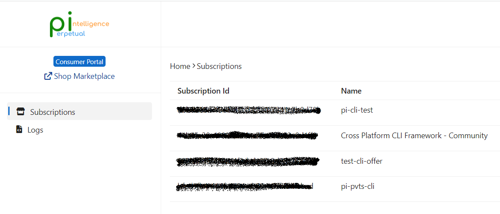
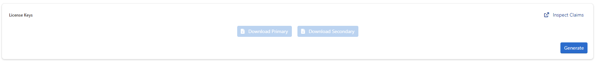
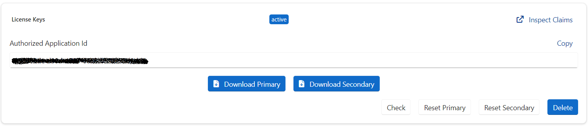
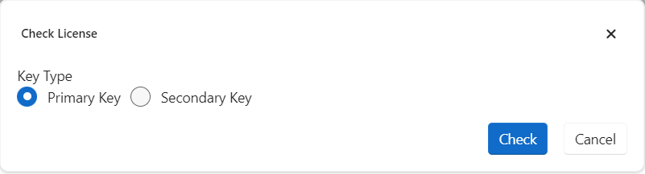
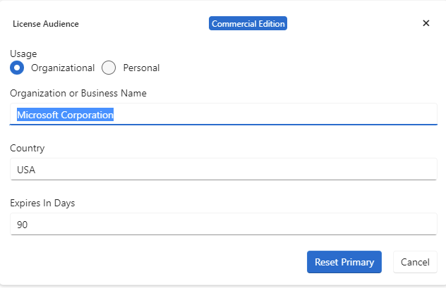

# License Keys

The license keys authorize your use of the `OneImlx.Terminal` framework against a valid license. The keys are signed JWT assertions with header, payload, and signature. 

The license keys are associated with your tenant account and an active subscription for the `OneImlx.Terminal` framework.

For each subscription, our system generates two keys. The two keys allow you to replace one while still using the other.
- Primary License Key
- Secondary License Key

The license keys are public signed keys with a `public-private` key pair. They ***do not*** grant any permissions such as creating, deleting, or modifying your data. You can use the license keys in your public CLI terminals, and we use them only to check the license claims.

> The license keys ***are not*** API keys or access_tokens.

For more information, see [JWT](https://jwt.io/introduction).

## License Audience Claims
The mandatory license audience claims to identify the valid license holder for the `OneImlx.Terminal` framework.
- `aud` claim identifies the recipients of the license keys. It is usually the person's name, organization or business name, or an educational institute name.
- `subject` claim identifies your subscription identifier
- `tid` claim identifies your consumer tenant identifier
- `tenant_ctry` claim identifies your consumer tenant country

> **Note**: Do not specify any sensitive information such as a secret, api keys, etc., in your license audience claims.

## Generate
You will need an active `OneImlx.Terminal` subscription to generate the license keys. If you do not have an active subscription, please visit [buying](../../buying/intro.md).

1. Go to our [Consumer Portal](https://consumer.perpetualintelligence.com/)
2. `Login` to your account
3. Browse `Subscriptions.`

4. Select and open the subscription for which you want to generate the license keys
5. Scroll down to the `License Keys` section

6. Select `Generate`
7. Specify your usage and license audience claims. 

8. Click `Generate` 

> **Note**: The license expiry is based on your subscription plan. It is `31` days for monthly subscriptions, `365` days for yearly subscriptions, and `90` days for community subscriptions. See https://github.com/perpetualintelligence/terminal/issues/20.

## Download
You can download your license keys with `Download Primary` or `Download Secondary` actions.

The downloaded file is a JSON file with license audience claims and licenses keys. See [usage](usage.md) to configure your terminal.

## Check
You can check your license key with our `Check` license feature.
1. Select `Check`
2. Select `Primary` or `Secondary` license keys

3. Click `Check` button
4. Please allow a few seconds to check and present your license key status

## Reset
The reset allows you to regenerate primary or secondary keys and replace them in your application based on your deployment strategy while still using the other key.
1. Select one of the `Reset Primary` or `Reset Secondary` options

2. Confirm you license audience claims

3. Click `Reset Primary` or `Reset Secondary` button
4. Please allow a few seconds to reset your license key

> **Note**: You cannot update your license audience claims during reset. You need to delete the license keys and generate new keys to change your license audience claims.

Currently, Reset will require redeploying your terminal. The fix is in progress, and it will enable customers to reset license keys without redeploying their terminals. See GitHub issue https://github.com/perpetualintelligence/terminal/issues/22 that tracks this issue.

## Delete
The `Delete` action will permanently remove your Primary and Secondary license keys. ***YOU CAN NOT UNDO THIS ACTION.***

> **Note**: Deleting your keys will affect your deployed terminals. The license check will fail, and the application will not start till you generate the keys and update your application configuration to you use the new keys.

See GitHub issue https://github.com/perpetualintelligence/terminal/issues/21 that will show a warning message before deleting.

