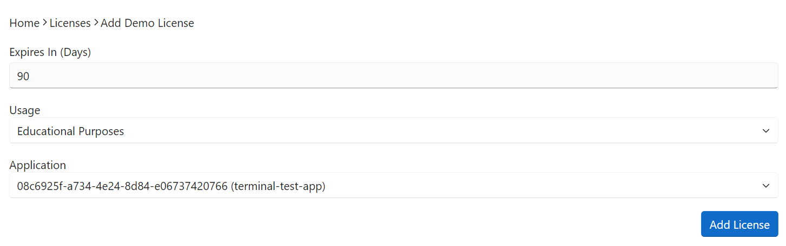
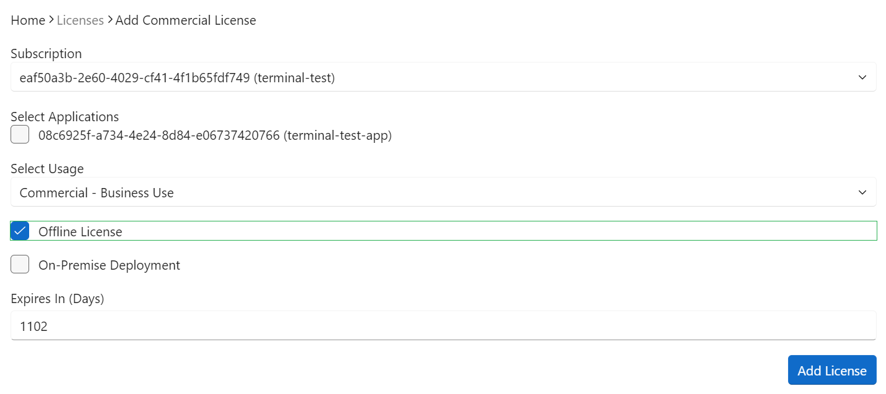

# License Management
Manage your `OneImlx.Terminal` framework licenses to ensure your applications are compliant with our licensing terms. This includes adding new licenses, checking, downloading, and resetting licenses.

## New License
First, register your application in our system. See [Applications](../gs/apps.md) for setup.

> **INFO:** Each tenant account may add up to 10 new licenses. For additional licenses, please [contact support](https://www.perpetualintelligence.com/support).

### Add Demo License

1. Log in to the [consumer portal](https://consumer.perpetualintelligence.com/).
2. From the **Licenses** menu, click **Add Demo License** button.
3. Choose your demo license usage, `Research Purposes` or `Educational Purposes`.
4. Select the applications you wish to license.
5. Click `Add License` button to create a new demo license.

> **INFO:** Each account can create at most ***one demo license***, valid for use in educational, community, or non-commercial projects.

To renew the demo license after its 90-day validity period, you must generate a new license or reset the existing one through the consumer portal.

### Add Commercial License

1. Log in to the [consumer portal](https://consumer.perpetualintelligence.com/).
2. From the **Licenses** menu, clixk **Add Commercial License** button.
3. Choose your subscription from the dropdown.
4. Select the applications you wish to license.
5. Choose your commerical license usage, `Commercial Business` or `Commercial Solo`.
6. Select if `On-Premise Deployment` is necessary for your terminal application.
5. Click `Add License` button to create a new commercial license.

> **INFO:** The features of commercial license depend on the chosen subscription plan. For details on each license edition see our [licensing documentation](intro.md).

### Download License
1. Log in to the [consumer portal](https://consumer.perpetualintelligence.com/).
2. Navigate to the **Licenses** menu, select the license you want to download.
3. Scroll down to the **Actions** section.
4. Click the **Download License** button to obtain the license file for your application setup.

### Check License
1. Log in to the [consumer portal](https://consumer.perpetualintelligence.com/).
2. In the **Licenses** menu, choose the license you need to check.
3. Scroll to the **Actions** section.
4. Click the **Check License** button to verify the status and details of your license.

### Reset License
1. Log in to the [consumer portal](https://consumer.perpetualintelligence.com/).
2. From the **Licenses** menu, select the license you need to reset.
3. In the **Actions** section, click the **Reset License** button.

> **INFO:** You may need to reset your license if you encounter issues with it or if reconfiguring your application's license setup is necessary.

### Delete License
1. Log in to the [consumer portal](https://consumer.perpetualintelligence.com/).
2. Navigate to the **Licenses** menu and select the license you wish to delete.
3. Scroll down to the **Actions** section.
4. Click the **Delete License** button to permanently remove the selected license from your account.

> **WARN:** Use caution with this action. Deleting a license is irreversible and may impact the operation of any applications relying on it.

## Advanced

This section is intended for advanced debugging purposes only.

### Copy License Key
1. Log in to the [consumer portal](https://consumer.perpetualintelligence.com/).
2. Go to the **Licenses** menu and select the license whose key you want to copy.
3. Scroll to the **Actions** section.
4. Click the **Copy License Key** button. This action copies the JWT license key to your clipboard, allowing you to use it for debugging or other advanced purposes.

### Inspect License Key
1. In the **Actions** section, click the **Inspect License Key** button.
2. This action automatically opens [jwt.ms](https://jwt.ms) in a new browser tab.
3. To inspect your license key, manually paste it into the provided field on [jwt.ms](https://jwt.ms). 

> **WARN:** Use the "Copy License Key" and "Inspect License Key" features for advanced debugging scenarios. Inspecting the license key allows for a detailed view of the license's encoded claims, aiding in troubleshooting.

## See also
[JWT](https://jwt.io/introduction)

