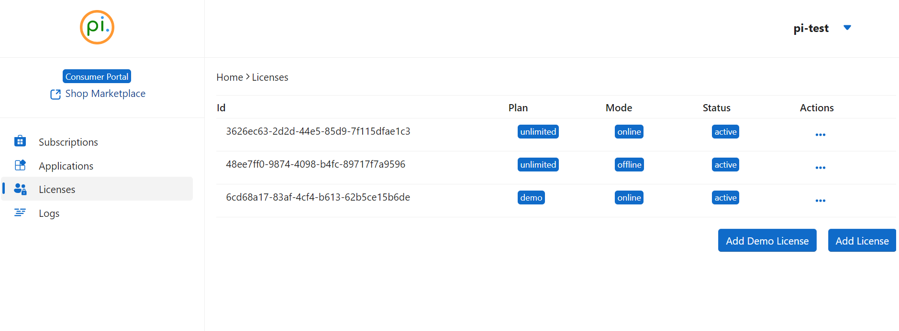
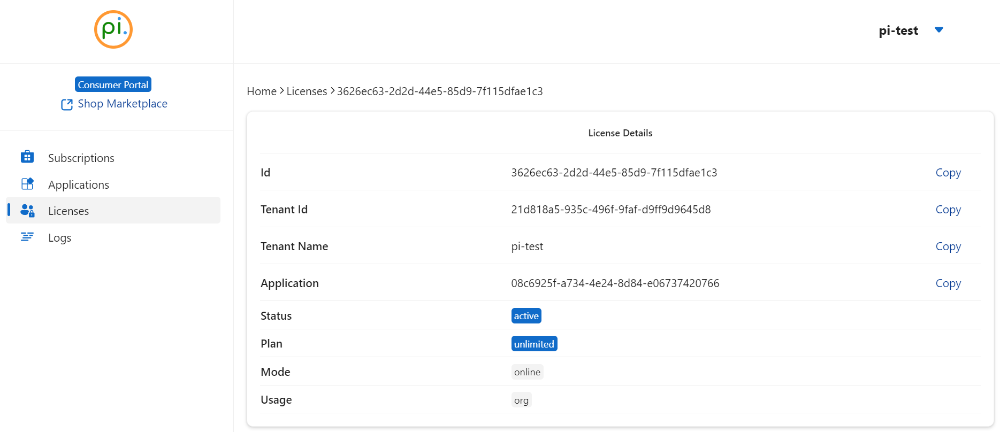

# Usage
Authorize your terminal or application to use the `OneImlx.Terminal` framework by configuring the [LicensingOptions](xref:OneImlx.Terminal.Configuration.Options.LicensingOptions).

To generate a new license, visit [add new license](licensemgmt.md).

## Identifiers
Identifiers ensure your terminal or application is configured correctly.

1. Visit our [Consumer Portal](https://consumer.perpetualintelligence.com/).
2. **Login** to your account.
3. Navigate to the **Licenses** menu.
   
4. Select the license you wish to use.
   
5. Copy the `Application` Id. If you have multiple applications, select the appropriate one.
6. Scroll down to `Actions` and click the `Download License` button.
7. Configure the `LicensingOptions` with your copied application identifier and the downloaded license file.

Specify the correct terminal license plan. Refer to @OneImlx.Shared.Licensing.TerminalLicensePlans for all available plans.

```csharp
options.Id = <your_application_id>;
options.Licensing.LicenseFile = <your_license_file_path_local_or_remote>;
options.Licensing.LicensePlan = <your_terminal_license_plan>;
```

**Example:** The code below shows our test application using our internal demo license.

```csharp
options.Id = TerminalIdentifiers.TestApplicationId;
options.Licensing.LicenseFile = "C:\\this\\perpetualintelligence\\tools\\lic\\oneimlx-terminal-demo-test.json";
options.Licensing.LicensePlan = TerminalLicensePlans.Demo;
```

For an offline license, particularly with the `On-Premise` or `Unlimited` license editions, the `onpremise` deployment option is available and may be used. This option is designed to facilitate the use of the `OneImlx.Terminal` framework in environments where internet connectivity is limited or secure internal deployments are required. Refer to `@OneImlx.Terminal.TerminalIdentifiers.OnPremiseDeployment`.

```csharp
options.Licensing.Deployment = OneImlx.Terminal.TerminalIdentifiers.OnPremiseDeployment;
```

## See also
- [Terminal Options](../configuration/options.md)